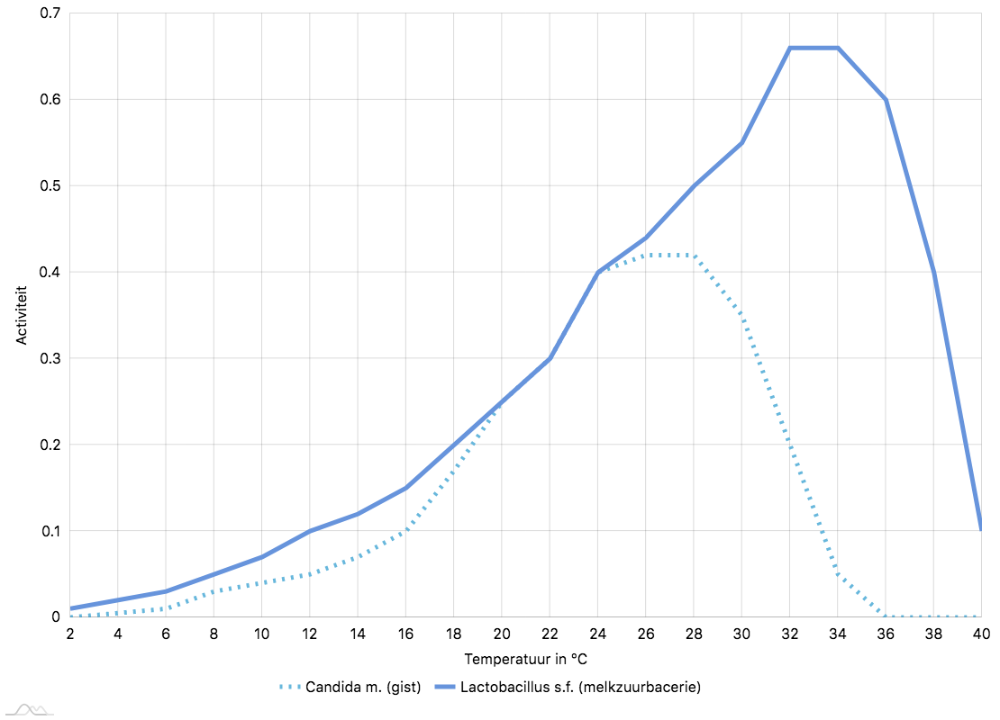
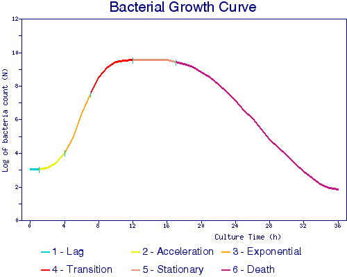

# Een crashcursus in microbiologie

> '_Decline is also a form of voluptuousness, just like growth. Autumn is just as sensual as springtime. There is as much greatness in dying as in procreation._' - Iwan Goll

## Maart 2013

Dingen worden rot. Organisch materiaal vergaat. Wanneer te kiezen voor het woord 'rot' of 'gefermenteerd', hangt af van waar je je ergens op de aardbol bevindt. Die dunne lijn is namelijk een culturele lijn. _Hákarl_, gefermenteerde haai, is een nationaal gerecht in Ijsland dat groentjes zou doen kokhalzen. Een potje Zweedse _Surströmming_ (in dit geval durf ik rotte haring te zeggen) openen kan je een boete opleveren, omdat de rotte geur nog dagen blijft hangen op die plek. Niet overgeven vóór de eerste hap is blijkbaar al een kunst. Chinese 'duizendjarige' eendeneiren worden een paar weken tot een paar maanden ingelegd in een mengsel van klei, as, zout, thee en rijstkaf. De lange fermentatietijd zet bestanddelen van het rauw ei om in zwavelzuur. En dat is geen plezante geur bij het pellen van het ei... Enkel doorgewinterde gistingsfreaks als Sandor Katz (of Chinezen) zijn hier voor te vinden. Sandor beschrijft in zijn bijbel '_The Art of Fermentation_' elke mogelijke vorm van rot, samen met bekend gefermenteerd voedsel [@katz]. 

Veel van die gefermenteerde producten zijn alom bekend, zoals:

> (Zuurdesem-) brood, eender welke alcoholische drank, ingelegde groenten als zuurkool en pickles, kaas, yoghurt, kefir, zure room, miso, soja- en vissaus

Wist je echter dat de volgende producten ook gefermenteerd waren:

> Olijven[^olijf], chocolade[^cocolade], azijn, ketchup, tabascosaus, worcestersaus, koffie, pu'er thee[^thee], salami, amazake[^amazake], katsuobushi

Commerciële varianten worden op een andere manier geproduceerd. Een blik groenten op de schappen van je lokale supermarkt wordt ingelegd met azijn. De erg zure omgeving is niet leefbaar voor organismen. Dat is iets heel anders dan groenten inleggen in water (en eventueel zout). 

[^olijf]: Rauwe olijven zijn oneetbaar door de aanwezigheid van bittere stoffen.
[^cocolade]: Verse cacaobonen, uit de peul, zijn slijmerig en paars, zoals lichi's. Na het fermenteren verliezen ze vocht, en krijgen ze die typische bruine kleur, klaar om verder geroosterd te worden. Hetzelfde principe geldt voor koffiebonen, waar fermentatie gebruikt wordt om het vruchtvlees van het zaadje te scheiden. 
[^amazake]: Het zoetere, niet-alcoholische alternatief voor saké.
[^thee]: Zwarte thee is geoxideerd (in aanwezigheid van zuurstof), niet gefermenteerd.

De bakkerijen en scholen leerden me op een praktische manier omgaan met deeg. Ik miste echter een goede theoretische basis. Wat gebeurt er eigenlijk, wanneer het brooddeeg rijst? Worden gisten echt 'gevangen' in de lucht? Mijn obsessie hield me ook buiten de keuken bezig. Ik was niet tevreden met de uitleg van de leerkrachten als ik vroeg waarom bepaalde dingen nodig zijn. 'Dat is beter voor het deeg' is niet goed genoeg. Om goed te begrijpen waarom deeg _leeft_, riep ik de hulp in van de wetenschap. Zuurdesem bestuderen bestaat voor mij niet alleen uit oefening, maar ook uit observeren, en het (proberen) begrijpen van de theorie.

Net zoals fotosynthese of ademhalen, is fermenteren een manier om energie uit moleculen te halen. Het afbreken van organische bestanddelen (zoals suikers) maakt plaats voor nieuwe elementen, waaronder kooldioxide. Dat herkennen wij als luchtbelletjes. Energie wordt sneller _aerobisch_ vrijgegeven, anders zouden onze longen weinig nut hebben. Fermenteren gebeurt echter _anaerobisch_: zonder zuurstof. Louis Pasteur, de eerste bioloog en chemicus die fermentatie serieus nam in 1860, noemde dit '_la vie sans air_'. Anaerobische fermentatie werkt trager, en geeft minder energie vrij. Wij gebruiken juist hetzelfde proces om energie uit ons eten te halen. De volgende keer dat je naar je potje met zuurdesem staart, denk dan maar aan je maag en darmen. 

De snelheid van fermentatie wordt geregeld door onder andere het zoutgehalte, de zuurtegraad, de vochtigheid en de temperatuur. Hoe meer zout, hoe trager dit proces. In Japanse miso zit gemiddeld `40%` zout: die wordt minstens 24 maanden ingelegd.  Wanneer ik in mijn keuken een beetje bloem met beetje water meng, creëer ik in feite een omgeving die perfect is om gisten én bacteriën te kweken. Enkel de witte laboratoriumjas waar de titel 'microbioloog' op prijkt, ontbreekt dan nog. Het opkweken van de juiste organismen duurt een paar weken. De eerste belletjes geven wel blijk van activiteit, maar de gistkolonie is nog te klein in aantal om een heel brooddeeg genoeg te laten rijzen. 

Deze combinatie van gisten en bacteriën vormen na verloop van tijd een stabiele symbiose. Je kan het een beetje vergelijken met kombucha[^kombucha] zwammen. Dit noemt men een _SCOBY_, een '_Symbiotic Culture of Bacteria and Yeast_'. Er zijn honderden verschillende soorten van beide organismes aanwezig. Commerciële gist bevat maar één giststam: _Saccharomyces cerevisiae_, ook wel bakkersgist genoemd. Een zuurdesemcultuur bevat veel meer stammen. Het aantal cellen van eenzelfde stam is echter minder groot dan in bakkersgist, waar meer dan een miljoen cellen maar één doel hebben: zo veel mogelijk suikers omzetten in CO~2~. Zowel gist als bacterie teert op energie in de vorm van suiker. Dat betekent een beetje gezonde competitie. Bacteriën zijn enkel aanwezig in zuurdesem, en niet in bakkersgist. Deze bacteriën zijn de voornaamste veroorzakers van _smaak_. Aha, nu geraken we ergens!

We hebben dus twee soorten van organismen nodig in brooddeeg, niet één. Bacteriën komen vanzelf, als je maar lang genoeg wacht. Een professionele bakker heeft echter geen tijd: hoe meer broden op korte tijd gebakken kunnen worden, hoe meer geld op de bankrekening. Deze kortzichtige visie levert middelmatige producten op, en nauwelijks bacteriën. Dat is de reden waarom je in 2 uur onmogelijk smaak op een natuurlijke manier krijgt toegevoegd aan brood. Een industriële bakker lost dit 'probleem' op met smaakstoffen en verbeteraars. Een bakker die begaan is met wat hij verkoopt, zet de deur open voor bacteriën door het rijsproces te verlengen. Wat bedoelen we nu eigenlijk als we het hebben over smaak? Om daar op te kunnen antwoorden, moeten we eerst kijken welke classificaties van organismen typisch aanwezig zijn in een zuurdesem cultuur:

* `Saccharomyces`: Gist. Produceert alcohol en CO~2~.
* `Candida`: Gist. Produceert alcohol en CO~2~.
* `Lactobacillus`: Bacterie. Produceert melkzuur en azijnzuur.
* `Eschericia coli`: Bacterie. Produceert melkzuur en azijnzuur.
* `Clostridium`: Bacterie. Pathogeen verantwoordelijk voor onder andere botulimse.

Gluten vangen afvalstoffen van gistcellen op, wat brooddeeg doet rijzen. De alcoholproductie is te verwaarlozen in vergelijking met het langere gistingsproces van bier of wijn. Ook pathogenen kunnen zich nestelen in je cultuur. Geen zorgen, in de zure omgeving overleven ze niet lang. Jonge desems zijn nog constant in verandering, waardoor het aan te raden is om langer dan een week te wachten met bakken. Melkzuur herkent iedereen die al ooit yoghurt gegeten heeft. Azijnzuur herkent iedereen die al ooit een fles azijn heeft geopend. Als bakker ben jij de alleenheerser die beslist hoeveel melkzuur en hoeveel azijnzuur in het brood moet terechtkomen. Deze fragiele balans perfect beheersen vereist jaren van ervaring. Typisch Duits brood bevat veel azijnzuur, terwijl men in San Fransisco liever veel melkzuur heeft. 

Verschillende soorten gisten en bacteriën verkiezen elk hun eigen ideale omgevingstemperatuur, vochtigheidsgraad en zuurtegraad. Dat zijn externe factoren waar een bakker mee kan spelen. Hoe warmer en vochtiger, hoe meer melkzuur. Hoe kouder en droger, hoe meer azijnzuur. Sommige bacteriën produceren enkel melkzuur, en sommigen melkzuur, azijnzuur, en CO~2~[^fermentatief] [@holzapfel2012genera]. Figuur \ref{activityvstemp}[^figactivitysrc] visualiseert de activiteit in functie van de temperatuur. Activiteit piekt voor gistcellen rond de `28 °C`, daarom gebruiken bakkers rijskasten ingesteld op zo'n hoge temperatuur. Voor typische melkzuurbacteriën ligt dat optimaal punt hoger, rond de `34 °C`. Ze verliezen de race naar suiker op dat punt, en jij verliest de veldslag om de smaak. Langer dan enkele uren op deze temperatuur zal het deeg niet uithouden. Boven de `32° C` sterven gistcellen af. 

[^fermentatief]: Dit is het verschil tussen homofermentatieve en heterofermentatieve melkzuurbacteriën. Dat eerste gebeurt ook in spieren als we sneller energie nodig hebben dan het bloed zuurstof kan aanleveren. Naslagwerken over metabolische routes bevatten meer informatie. 
[^figactivitysrc]: Deze gegevens komen uit een onderzoek naar de groei van bepaalde stammen in zuurdesem fermentatie [@ganzle1998modeling].

{ width=80% }

Buiten de temperatuur, is tijd de tweede belangrijkste factor. Daar hebben we een tweede grafiek voor nodig, zoals figuur \ref{groeicurve}, die de bacteriële groeicurve voorstelt. Bacteriën ondergaan verschillende levenscycli die de groei stimuleert, of afremt. De belangrijkste fase waar wij in geïnteresseerd zijn is de exponentiële groeifase: hoe meer leven in de brouwerij, hoe meer smaak! Tussen de opkweek- en afbraakperiodes ligt een grote stilstaande fase waarin de cultuur min of meer stabiel blijft, tussen de 12 en de 20 uur na de eerste groeischeut. Fermenteer je langer dan die periode, dan gaat alles gradueel bergaf. De koelkast gebruiken om de temperatuur uit figuur \ref{activityvstemp} te beïnvloeden kan dus maar voor een beperkte periode. En dan hebben we vochtigheid en zuurtegraad nog niet besproken. 

{ width=80% }

Als je werkt met een 1:1 ratio van bloem en water, is het eenvoudig om de activiteit van je cultuur te controleren. Gebruik hiervoor een doorzichtige container. Na het voeden met bloem trek je met een alcoholstift een streep tot op welke hoogte de desem komt. Deze stappen kan je volgen in figuur \ref{groeicurve}. De eerste uren gebeurt er niet veel. (_1. vertraging_) Op een gegeven moment schieten de organismen wakker en beginnen ze als een gek te werken. (_3. exponentiële, 2. versnelling_) De vloeistof piekt op een bepaalde hoogte, en blijft voor een tijdje vrolijk broebelend daar staan. (_4. overgang, 5. stationair_) Plots zijn alle suikers op en klapt het goedje in elkaar. (_6. dood_) Als je dan nog langer wacht, verzuurt de omgeving nog meer. Er verschijnt een waterig laagje bovenop de zuurdesem. Dat is alcohol die aangeeft dat je cultuur erg hongerig is. Laat je niet beïnvloeden door de sterke azijngeur en gooi niet alles weg. Te lang wachten met bijvoeden kan voor de volgende baksessie een nog tragere rijs betekenen, door de verstoorde zuurtegraad. Gooi in dat geval alles weg, behalve één koffielepel, en kweek opnieuw op met voldoende bloem en water. 

Het woord bacterie heeft nogal een negatieve connotatie in onze moderne maatschappij, waar obsessief poetsen met bacteriewerende middelen een slechte gewoonte geworden is. Het menselijk lichaam bestaat uit triljoenen microbiële cellen, veel meer dan eigen menselijke cellen [@rosner2014ten]. Wij zijn een gigantische bus waar constant bacteriën op- en afstappen. Niet iedereen heeft een buskaartje gekocht, maar de meesten houden zich gedeisd, en werken zelfs in ons voordeel. Ons darmstelsel is heel gevoelig en bevat het meeste van deze cellen. Vandaar de groeiende aandacht voor pre- en probiotica [@voedselmachine]. Prebiotica zijn componenten in voedsel dat de productie van deze goede organismen stimuleert, zoals look, prei, asperge en volkoren tarwe. Probiotica zijn levende micro-organismen die de darmflora moeten aansterken, zoals yoghurt en kefir[^prob]. In realiteit overleven de meeste organismen de zuren in je maag niet. Om te kunnen genieten van de voordelen van probiotica, moeten de organismen nog leven. Gepasteuriseerde zuurkool van je supermarkt valt hier dus niet onder. Zuurdesem zelf zou ook beschouwd kunnen worden als probiotica, maar ik zie mezelf niet bepaald dagelijks een lepeltje naar binnen werken. Gebakken brood heeft hier niets meer mee te maken: de hitte van de oven verwoest al het leven. 

[^kombucha]: Een licht bruisende en alcoholische gefermenteerde drank, gemaakt van gezoete zwarte of groene thee.
[^prob]: Niet alle commerciële probiotica wordt de tijd gegeven om bacteriën te kweken. Yakult bijvoorbeeld bevat hopen _Lactobacillus paracasei Shirota_, opgekweekt in laboratoria [@spanhaak1998effect]. 

Niet alleen onze interne organen behuizen hopen bacteriën: onze huid kan hier ook wat van. Hoe onaangenaam dit ook klinkt, de zweetvoeten en schimmels waar wij soms last van hebben worden veroorzaakt door dezelfde soorten organismen die in ons potje met desem voorkomen. De Ongelovige Thomas probeert dit thuis zelf door een beetje 'geproduceerd vocht' te mengen met bloem en water. Deze 'verrijkte' zuurdesemcultuur zal véél sneller op punt staan dan de conventionele manier. Er is zelfs iemand die met succes vaginaal vocht gebruikte om brood te bakken. Ik ga de details jullie besparen en mijn referenties niet verder bevuilen: zoek dat maar op internet.

Er zijn buiten smaak nog twee belangrijke redenen om met een rijke kolonie als zuurdesem te werken, in plaats van met één giststam. De eerste daarvan is _vertering_. De mensheid heeft doorheen de geschiedenis verschillende manieren gevonden om voedsel beter verteerbaar te maken [@pollancooked]. Groenten koken transformeert cellulose in licht verteerbaar materiaal. Door het kookproces komen vitaminen en mineralen vrij die door onze darmen kunnen opgenomen worden. Rauwe groenten kost onze maag en darmen veel meer moeite om te verteren dan bereide groenten. De kookpot fungeert in feite als onze tweede maag. Koeien mogen ons niet onderschatten, wij mensen vinden altijd wel iets op onze gebrekken. Er zijn buiten koken nog andere technieken om voedsel beter verteerbaar te maken, zoals fermenteren. Wetenschappers hebben ontdekt dat het gebruik van zuurdesem de biologische beschikbaarheid van mineralen verhoogt [@poutanen2009sourdough]. Ook hier speelt de tijd een grote rol: hoe meer het is gefermenteerd, hoe meer het verteerbaar is. Wacht je echter té lang, dan valt er helemaal niets meer te verteren. De suikers zijn dan volledig opgebruikt.

Hoe komt het dat fermenteren voedsel plots eetbaar maakt? Dat is heel simpel: giftige stoffen worden afgebroken door het proces. Linamarine, afkomstig van  bladeren of wortels van planten, kan waterstofcyanide produceren als het in aanraking komt met de enzymen van onze darmflora. Maniok wordt daarom behandeld in plaats van rauw gegeten [@okafor1986microbial]. Ook complexe suikers worden omgezet in enkelvoudige suikers, die beter opneembaar zijn door onze darmwand. Suikers vallen in drie verschillende categorieën:

* Enkelvoudige suikers (_monosacharide_): glucose, fructose, galactose
* Dubbelvoudige suikers (_disacharide_): sucrose (tafelsuiker), lactose, maltose
* Complexe koolhydraten (_polysacharide_): lange kettingen van enkelvoudige suikers, zoals zetmeel. 

Hoe complexer de suiker, des te moeilijker te verteren. Enkelvoudige suikers worden door een complex stofwisselingsproces genaamd _glycolyse_ verder omgevormd met als voornaamste resultaat energie, wat ons in staat stelt om onze spieren te bewegen [@turner1980regulation]. Suiker wordt tegenwoordig vanwege epidemieën als obesitas in een slecht daglicht gesteld. Toch heeft iedereen dit nodig om te overleven. Brood wordt vaak als eerste uitgekozen om op te schieten. Misschien moeten we dan maar allemaal overschakelen op zuurdesembrood? Het is immers aangetoond dat zuurdesem de vertering van zetmeel kan vertragen, wat leidt tot minder grote suikerpieken in het bloed [@poutanen2009sourdough]. 

Het fermentatieproces kan je beschouwen als een schaar die de lange ketting netjes opknipt in kleinere, eenvoudiger verwerkbare stukjes. Het zijn trouwens niet alleen de gisten, maar vooral de bacteriën, die hier het zware werk verrichten. Die hebben ook suikers (energie) nodig om in leven te blijven. Zoals iedereen zijn lievelingseten heeft, zo hebben deze organismen ook hun eigen voorkeur. Soms ontstaat er hevige competitie, maar soms ook niet. Het soort van suiker speelt dus ook een rol [@gobbetti1994sourdough]. Door het opknipproces van de suikerkettingen verandert de samenstelling in het deeg, waarbij plots bepaalde bacteriën sneller reproduceren dan voorheen. Een (verplicht) samenwerkingsproces dus, waarbij het contract vergeten werd te ondertekenen. '_Imma make you an offer you cannot refuse_' klinkt het in het deeg. Na een tijdje zijn de meeste suikers omgezet, en verzuurt de omgeving door een teveel aan azijnzuur. Dat punt herken je doordat het gerezen deeg begint in te storten. De glutenstructuur breekt, de lucht is weg, en je blijft met een baksteen zitten. 

\includepdf[
    scale=2.0,
    addtolist={1, figure, {Zichtbare activiteit in een rogge zuurdesem starter.}, img:broebel}    
]{broebel.jpg}

Nu we iets meer weten over suikers, kunnen we het bakproces beter controleren, door bijvoorbeeld de juiste bloem te kiezen. Volkoren meel bevat veel meer voedingsstoffen voor organismen dan gezeefde, witte bloem. Daarom wordt een zuurdesemcultuur meestal met roggemeel opgestart. Rogge fermenteert nog sneller dan tarwe [@koistinen2018metabolic]. Ook zal je bij het gebruik van volle granen de rijstijd moeten verkorten of de temperatuur verlagen. Extra ingrediënten als melk (lactose) tellen ook als suiker. 

Het tweede belangrijke voordeel van zuurdesem is _houdbaarheid_. Door het langere fermentatieproces wordt de levensduur van voedsel verlengd [@saikia2014effect]. Zuurdesemboord blijft een week goed. Ik durf te wedden dat het gistbrood dat je gisteren kocht bij de bakker overmorgen al beschimmeld is. 'Schimmel' is een algemene term die we gebruiken om aan te geven dat iets niet meer eetbaar is. We weten nu ook dat schimmels helpen om lekker brood te maken. Schimmels en gisten zijn immers beiden deel van het _Fungi_ rijk. Gist is ééncellig, schimmel is meercellig. De geur én de kleur geven aan wanneer dat sneetje brood aan de kippen te geven. Verschillende kleuren duiden verschillende soorten van schimmel aan[^kleursch], die elk hun eigen voorkeur voor warmte, energiebron (type suiker) en humiditeit hebben. Beschimmeld brood komt zo vaak voor dat de voornaamste veroorzaker, de _Rhizopus_ stam, door wetenschappers bekroond werd met de titel 'broodschimmel' [@wilkins2009bread].

[^kleursch]: Dat is niet de enige reden: sporen van schimmels hebben vaak een andere kleur. 

De langere houdbaarheid betekent niet dat zo'n brood bestand is tegen uitdroging. Vochtverlies treedt onherroepelijk op, en is niet te stoppen. Dat kan in combinatie met een broodrooster en wat boter nog steeds een smakelijke maaltijd vormen. Het vocht vindt uiteindelijk zijn weg naar de rand van het brood: de korst, waar het verder kan verdampen [@baik2000moisture]. Daardoor wordt de korst zachter, en het kruim harder. Knapperig gebakken brood verkoop je als bakker best binnen een paar dagen, want het is gedoemd om terug zacht te worden. Hoe langer je brood bakt, hoe dikker de korst, en hoe langer het duurt om terug zacht te worden. Brood met een hoog vochtigheidspercentage wordt langer gebakken omdat het kruim langer nodig heeft om te stabiliseren. Dit heeft dus als bijkomend voordeel dat de korst stand houdt. Hoe meer vocht in het kruim, hoe langer het duurt dat dit verdampt, dus hoe langer de houdbaarheid. Sneetjes brood zonder korst bewaren vertraagt dit proces nog verder. 

## Mei 2013

Wachten op spontane fermentatie kan best spannend zijn. De ontdekking van bubbeltjes voelt aan als een geweldige prestatie - maar in feite heb je niets anders gedaan dan gewacht. Een actieve cultuur is maar één deel van het broodbakproces. Om brood te kunnen bakken met zuurdesem heb je een voordeeg nodig. Er bestaan verschillende soorten van voordeeg die allemaal hun eigen naam hebben. Dat is te danken aan de rijke Europese broodbakgeschiedenis. Hieronder volgt een kort overzicht:

* _Biga_: Een Italiaans voordeeg, gebruikt in onder andere ciabatta’s. Dit is een droger voordeeg met een hydratatie van `50` tot `70%`. 
* _Poolish_: Een Frans voordeeg met Poolse origines, gebruikt in onder andere baguettes. Dit is een erg vochtig voordeeg met een hydratatie van `100` tot `125%`.
* _Pâte Fermentée_: Een Frans voordeeg dat een overgebleven stukje deeg is van een vorige baksessie. (Letterlijk vertaald als _oud deeg_). Meestal wordt 1/3de van het deeg na de bolrijs aan de kant gezet voor de volgende keer. In tegenstelling tot de andere types, zit hier ook een beetje zout in. Variabele hydratatie. 
* _Sourdough starter_: Je zuurdesem cultuur. Het woord starter refereert naar de 'kickstart' die je je voordeeg geeft, door de toevoeging van een hoop actieve en gevariëerde organismen. 

Vergeet niet dat een voordeeg niet per se betekent dat je met zuurdesem aan het werk bent. Een voordeeg is letterlijk een _pre-ferment_: een stukje op voorhand gefermenteerd deeg, dat genoeg gisten en melkzuren opkweekt voor smaak en volume. Hoe dat fermentatieproces opgestart wordt maakt niet uit: een mespuntje gedroogde gist is ook voldoende. Een biga en poolish voordeeg bestaat meestal uit `0.1%` gedroogde gist, zonder desem. Dat is erg weinig gist: een koffielepel is al snel `2%`!
In feite worden woorden als chef, starter, moederdeeg, madre bianca, levain en sourdough als synoniem gebruikt. Het duidt allemaal op het gebruik van een op voorhand gefermenteerd stukje deeg. Het ene voordeeg heeft wat meer water als het andere, maar de techniek en het doel is hetzelfde. 

'_Desem_' is eigenlijk de benaming van een bekende Belgische cultuur, bestaand uit rond de 50% water en volkoren tarwe. Die combinatie zorgt voor een nootachtige, lichtzurige smaak. Creatief omgaan met gefermenteerd voedsel levert je een scala aan unieke culturen op. Je hoeft immers niet met enkel bloem en water iets op te kweken: pekelvocht van zuurkool, yoghurt of wei werken minstens even goed. Die dingen bevatten al honderden organismen die staan te trappelen om je brooddeeg te laten rijzen. Toen ik iets gelezen had over 'gist water' op _The Fresh Loaf_, wist ik de zoveelste container te vullen met iets dat rot wordt: water en appels. Na een aantal dagen pulp uit het glas te vissen om dat te vervangen met verse stukjes appel, begon het volop luchtbellen te kweken. Ik had met succes de gisten op de schil van het fruit overgebracht in het water. Vanaf dan is het een kwestie van een voordeeg te maken met dat water. Het voordeeg fungeert in feite als een zeer kort gefermenteerde zuurdesem die toch voldoende gisten weet te produceren om brood te laten rijzen.

Dit vangen van ‘wilde gisten’ is een echt werkje: in tegenstelling tot simpelweg wat bloem en water mengen, moet je hier regelmatig volledig opnieuw beginnen. De dragers van de gisten (in dit geval appels) immers moeten vervangen worden, en de constante af- en aanvoer van het vocht verdunt de cultuur. Je kan dus niet tientallen keren met dezelfde appelgist blijven bakken. Het verbaast je daarom misschien niets dat dit disciplinair proces iets is waar Japanners graag mee werken. Bakker Taro Hashiguchi gebruikt enkel gisten die hij in zijn eigen tuin kan oogsten op fruit, kruiden en bloemen. Als gevolg daarvan is zijn bakkerij _Taro-ya_[^taroya] te Tokyo maar twee dagen per week open... De smaak van mijn eigen poging was geen hoogvlieger. Ik miste de complexiteit van de zuren in een typische granencultuur. Weer een experiment voor de composthoop. 

[^taroya]: [http://www.taroya.com](http://www.taroya.com)

Elke zuurdesem cultuur is uniek. Ik heb veel succes gehad met een kikkererwtenmeel zuurdesem cultuur. Toen er meer dan vier ‘vieze’ potjes in de koelkast stonden te pruttelen, heb ik van Kristien enkele hartverscheurende keuzes moeten maken. Tegenwoordig onderhoud ik slechts één cultuur op basis van tarwe. Mijn vertrouwde rogge cultuur is moeten wijken voor tarwe omdat ik in tegenstelling tot professionele bakkers niet dagelijks bak, en de rogge  daardoor te veel azijnzuur produceerde. Als ik een een andere cultuur nodig heb, kweek ik die op basis van mijn tarwe starter. Meerdere culturen betekent meer tijd nodig om ze te onderhouden. Dat onderhoud is er om uitbesteed te worden. Bakkerij _RC Chocolat_[^rc] te Stockholm biedt reizigers de mogelijkheid om tegen een klein bedrag op een zuurdesemcultuur te babysitten. De Zweden zijn op dat vlak heel wat progressiever dan wij: in supermarkten ligt ‘_surdeg_’ gewoon in de rekken, naast de gedroogde gist. Dankzij de stijgende populariteit van zuurdesem ontstaan er hotel services die aanbieden om je cultuur tijdig te voeden wanneer jij aan het strand ligt te luieren. Ik heb ook al verhalen gehoord van mensen die een beetje desem overal mee naartoe zeulen, ook op vakantie. Je weet maar nooit! 
Het heeft weinig nut om de cultuur actief te houden als er niet elke dag gebakken wordt. In dat geval hou ik mijn potje in slaapstand, in de koelkast. 

[^rc]: [https://rcchocolat.se/](https://rcchocolat.se/ )

Gewapend met mijn nieuwe kennis van microbiologie ontketen ik elke week een met het blote oog niet waarneembare oorlog in mijn keuken. Door te spelen met principes als vocht- en zoutgehalte, zuurtegraad, temperatuur en tijd bepaal ik als bakker hoe mijn brood smaakt. Er is echter nog een probleem. Het oog wil namelijk ook wel wat. Hoe krijg ik genoeg volume in mijn deeg, zonder dat het plat valt zodra het uit het rijsmandje komt? Niet te kort of te lang laten rijzen is één ding, maar geen structuur betekent geen vorm. En geen vorm vermindert ook smaak: niemand eet alleen maar met zijn mond [@delwiche2012you]!

\newpage

## Wat ik geleerd heb

* Fermenteren en rijzen: twee woorden voor hetzelfde idee.
* (Ongeveer) hetzelfde proces wat wij gebruiken om ons voedsel te verteren, wordt ook gebruikt om brood te maken. 
* Een bakker is eigenlijk een God, die het lot bepaald over duizenden organismen. 
* Die organismen zijn te beïnvloeden door te spelen met vochtigheid, zuurtegraad, zoutgehalte, temperatuur en tijd. 
* Smaak komt niet van één giststam, maar van veel melkzuurbacteriën. 
* Elke zuurdesemcultuur is uniek en permanent verbonden aan de regio.
* De ideale temperatuur van brood is `24 °C` - in de meeste gevallen. Verscheur alle bakboeken waar in staat dat brood op _een warme plaats_ moet rijzen. 
* De ene suiker is de andere niet. 
* Bacteriën groeien niet liniair, maar exponentieel. 
* Open nooit een blik gefermenteerde haring op een openbare plaats - en misschien best ook niet in een gesloten ruimte. 
* Zuurdesembrood houdt langer dan gistbrood.
* Staat er een waterlaagje op je starter, of ruikt hij erg naar azijn? 90% weggooien en bijvoeden. 
* Staat er gekleurde schimmellaag op je starter? Pech gehad, alles weggooien! 
* Chocolade is ook een gefermenteerd product, dus dan moet het wel gezond zijn... 
