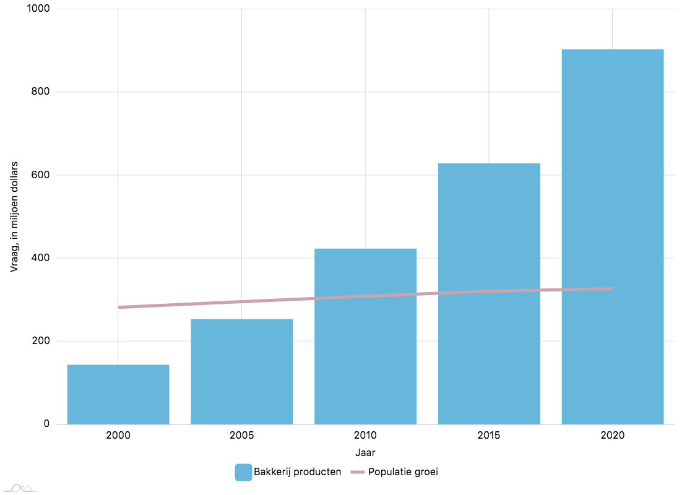

## De esthetiek van brood

> '_The human soul needs actual beauty more than bread._' - D.H. \mbox{Lawrence}

### Structuur

'Amai, deze is echt mooi!' 'Ja, en groot. Wat een _joekel_. Raak eens aan?' 'Neenee, nog niet, anders is het al besmeurd.' 'Je weet dat je het wilt... Het ziet er hard uit.' 'Oké, heel even dan.' 'Ik zal niet kijken!'

\index{Poilâne}
\index{Miche}

Voordat iemand de verkeerde conclusie trekt: we bevinden ons in het hartje van Parijs, in één van de legendarische Poilâne bakkerijen. Dimitri, Tom en ik schuimden dat weekend alle bakkerijen in kleine en grote straten af, op zoek naar geweldig uitziend en smakend brood (en croissants, en vooral ook aardbeienbavarois). Poilâne staat bekend om zijn _miches_, een heel groot rustiek rond brood versierd met een prachtige bebloemde '`P`'. Dat groot en hard ding dat we aan het bewonderen waren, was een zopas aangekochte _demi_ miche. De broden zijn zo groot (meer dan `2 kg`) dat ze in halven of kwarten verkocht worden. Het brood is niet ingesneden, en heeft dus geen mooie opengebloeide korst. Het is evenmin prachtig van kleur of vorm. En toch doet het zicht van de uitgestalde miches je 'wow' zeggen als je voorbij de vitrine van de bakkerij wandelt. De reden is niet alleen ruwe kracht en eenvoud, maar ook respect. Als bakker herken je immers of er veel of weinig water bij aan de pas kwam, dus of het moeilijk of makkelijk was om zo'n deeg de baas te blijven. 

Brooddeeg heeft buiten de belangrijke gistingtijden namelijk ook nog een vorm nodig, als je niet wilt dat het als een platte pannenkoek uit de oven valt. Brood vorm geven is voor mij dé moeilijkste stap in het hele broodbakproces. Tijdens het bakken ondergaat het deeg een metamorfose die de structuur, vorm en kleur mee bepaalt. Deze veranderingen worden in de oven op gang gezet door expansie van volume, verdampen van water, vorming van een poreuze structuur die wij 'kruim' noemen, verandering van eiwitstructuur, gelatinisatie van
zetmeel, korstvorming en bruiningsreacties [@miguel2013enzymes]. Iedereen koopt graag een brood dat er 'goed' uit ziet. Wat is het verschil tussen een sterrenrestaurant en een gewone zaak? Het éérste verschil, wat onmiddelijk opvalt, is de presentatie. Voordat je ook maar iets naar binnen kan werken, hebben je ogen al gegeten. Presenteren is voor een bakker minstens even belangrijk als voor een chef. Top patissiers zijn erg goed in het variëren van smaak en vorm. Patisserie wordt om een of andere reden kritischer beoordeeld met het oog dan brood. Ik neem aan dat brood meer aanschouwd wordt als een noodzakelijk kwaad. 'Ik moet nu eenmaal iets eten.' Wanneer je een brood koopt, en er is geld over voor een éclair, dan 'verwen je jezelf'. Als je enkel dat brood koopt, dan 'moet een mens nu eenmaal eten'. Waarom zou je jezelf niet kunnen verwennen met brood? 

In de praktijk heeft het natuurlijk te maken met de grootte en de ingrediënten. Met suiker worden enorme pronkstukken gemaakt, maar dat wil ik niet op mijn brood hebben. De eindeloze combinaties die verkocht worden bij 'L’Éclair de Génie' in het vierde arrondissement zijn mogelijk doordat men kan spelen met onder andere de toplaag (ganache, aardbeien, munt, citroen, ...), de pudding (vanille, pistache, caramel, amandel, ...), en de vorm. En toch is _less_ vaak ook _more_, zoals de miches van Poilâne. 

\index{Calvel, Raymond}
\index{Autolyse}

Om te begrijpen hoe brood zijn vorm behoudt blijven we nog even in Frankrijk. Professor Raymond Calvel heeft de tweede wereldoorlog meegemaakt. Na de oorlog is het industrialisatieproces van brood in vierde versnelling geschoten. Zelfs in zijn geliefd Frankrijk werd brood nog nauwelijks _a l'ancienne_ gemaakt: hoe meer gebakken op korte tijd, hoe beter. Bakkers werden verleid door het ingeburgerd kapitalistisch wereldbeeld en de dalende prijs van machinerie. Wat er echter nog daalde, was de kwaliteit en de smaak van het typisch Frans brood. Professor Calvel is een van de beroemdste voorvechters verantwoordelijk voor de revival van oude tradities in het broodbakken. Zijn boek 'Le Goût du Pain' puilt uit van de technische informatie over gluten structuren, tarwesoorten en vorm van brood [@calvel]. Calvel is vandaag vooral gekend om de ontwikkeling van de _autolyse_ techniek. 

Tarwedeeg heeft twee fysiek waarneembare eigenschappen: _elasticiteit_ en _uitrekbaarheid_. Dit is te danken aan twee groepen van gluten eiwitten in tarwe: _glutenine_ zorgt voor de elasticiteit, en _gliadine_ voor de uitrekbaarheid. De juiste balans tussen deze twee eigenschappen zorgt voor een superieur brood op gebied van kruim en vorm [@barak2013relationship]. Het totale eiwitgehalte van bloem is niet de enige indicator om volume van brood te voorspellen. Te weinig elasticiteit kan tot een gebakken baksteen leiden. Te veel elasticiteit belemmert de uitzetting van gascellen. Opnieuw een baksteen. Na decenia gekibbel zijn wetenschappers het nog steeds niet eens wat de juiste verhouding tussen glutenine en gliadine zou moeten zijn om hét perfecte brood uit de oven te toveren. 

\index{Gluten}
\index{Gluten!Glutenine}
\index{Gluten!Gliadine}

Deze eiwitten haken zich aan elkaar vast zodat lucht gevangen wordt en brood kan rijzen. Dit vasthaken is echter ook een vervelend probleem om met het deeg te werken. Kneden wordt dankzij diezelfde gluten moeilijker. De enzymen die we leerden kennen in hoofdstuk \ref{microbio} spelen hier een grote rol in. Amylase is niet het enige belangrijke enzym dat in bloem zit. Voor de structuur van het deeg zijn de volgende enzymen belangrijk:

\index{Enzymen}
\index{Enzymen!Protease}
\index{Enzymen!Lipase}
\index{Enzymen!Xylanase}
\index{Enzymen!Glucose-oxidase}

* _Protease_. Dit enzym breekt aminozuren tussen eiwitten af. Dat klinkt niet goed, aangezien de zorgvuldig opgebouwde gluten structuur juist nodig is om brood te doen rijzen. Gelukkig genoeg zijn deze jongens vrij bescheiden in hun werk. Ze maken het voor de bakker gemakkelijker om deeg te kunnen kneden. 
* _Glucose-oxidase_. Maakt door een oxidatiereactie met de gluten het deeg krachtiger en elastischer. 
* _Lipase_. Lipase helpt de luchtigheid er in te houden wanneer het deeg te lang gerezen heeft. Dit enzym versnelt de opneembaarheid van aanwezige vetten[^hydro] (lipiden).
* _Xylanase_. Een typische 'conditioner' die het deeg handelbaarder maakt. Hiermee wordt vaak een verbeterde mechanische bewerkbaarheid[^bewerk] bedoeld.

[^hydro]: Dit proces noemt men _hydrolyse_, de splitsing van een chemische verbinding onder opname van water. 

De autolyse fase zorgt er via protease voor dat het deeg werkbaar is. Deze fase is niets meer dan een rust fase voordat gist, desem en zout toegevoegd wordt aan het deeg. Bloem en water worden heel kort gemengd, totdat er geen droge bloem meer zichtbaar is. De kneedmachine wordt stilgelegd om de bloem tijd te geven het water op te nemen. Bevochtigd bloem betekent de start van gluten vorming, maar ook de de activatie van protease die deze gluten enigzins verzacht. Een autolyse fase invoeren betekent extra tijd vrijmaken. Industriële processen hebben die tijd niet, en gebruiken onder andere toegevoegde pentosen[^pentose] om meer water te kunnen opnemen. Hoe meer tijd deeg krijgt, hoe meer gluten gevormd worden zonder manuele interventie in de vorm van kneden. Het voordeeg van een zuurdesemdeeg heeft uren nodig gehad om smaak en gisten te ontwikkelen. Calvel's autolyse marginaliseert de nood aan kneden nog meer. 

[^bewerk]: _Machinability_ is een belangrijk onderwerp van wetenschappelijk onderzoek naar brood. Jammer genoeg heeft dit maar één reden: opbrengst. 
[^pentose]: Een polysacharide. Zie hoofdstuk \ref{microbio:suikers}.

_No-knead bread_ is een erg populaire zoekterm in Google. Goede recepten zullen zeker een autolyse stap bevatten. Maar dat is niet de enige manier om deeg meer kracht en structuur te geven zonder veel te moeten kneden. Soms is het deeg zo nat, dat het bijna niet kneedbaar is. In die gevallen wordt er niet gekneed, maar _gevouwen_. Inderdaad: vouwen, zoals een brief of de was. Het deeg wordt uitgestort op een werkoppervlakte, waarna één derde naar binnen gevouwen wordt. Het ander uiteinde wordt daarop gevouwen, en men herhaalt de stappen na 90° draaien. Die hoop gevouwen deeg wordt met enkele snelle bewegingen terug in de container geplaatst om verder te rijzen. Dit proces herhaalt zich een aantal keer tijdens de eerste rijs. Bij het opbollen voel je duidelijke opgebouwde spanning dankzij dat vouwproces. Zonder vouwen komt slap deeg als een pannenkoek uit de oven. 

Een laag of hoog eiwitgehalte is dus niet het grootste verschil tussen een plat of een mooi gerezen brood. In Frankrijk worden sommige broden met een laag eiwitgehalte gebakken. Tarwe met minder dan `10%` eiwit wordt aanschouwd als _zachte_, of _zwakke_ tarwe. _Harde_ tarwe bevat meer eiwitten. Ook de oogsttijd beïnvloed het eiwitgehalte. Tarwe geplant in het najaar en geoogst na de lente noemt men (zachte of harde) _wintertarwe_. Tarwe geplant in het voorjaar en geoogst in datzelfde najaar noemt men (zachte of harde) _lentetarwe_. Harde wintertarwe heeft een eiwitgehalte van `10` tot `12%`. Voor harde lentetarwe is dit `12` tot `14%`. Werken met zachte tarwe voelt zelfs voor een leek heel anders aan dan werken met harde tarwe. 

Zachte of harde tarwe heeft niets te maken met de gekende Italiaanse '`00`' bloem! _Tipo `00`_ is een aanduiding voor uitmalingsgraad, zoals de Franse `T65`. Dit is de fijnste graad van bloem in Italië en heeft de consistentie vergelijkbaar met talkpoeder. In Nederland is deze bloem verkrijgbaar onder de naam 'Zeeuwse bloem'. `00` bloem is beschikbaar in verschillende eiwitgehaltes en dient vaak eerder voor pasta of pizza te maken dan voor brood. De methode voor pizzadeeg is inderdaad exact hetzelfde als voor brooddeeg, maar met deze bloem heb je veel minder water nodig. Na het zeven blijft er enkel nog een deel van het kiemwit van de tarwebes over. De uitgezeefde (restjes van) zemelen helpen om vocht te absorberen. De hoofdredenen om `00` bloem te gebruiken in pizzadeeg is het verminderen van de taaiheid van de korst, en de uitrekbaarheid tot de limiet kunnen drijven. De elasticiteit van brooddeeg zit soms in de weg bij het maken van een goede pizza. In dat geval is voldoende rusttijd belangrijk. 

Ik gebruik nooit erg uitgezeefde bloem. Zoals Sarah in De Superette ook al zei: '`T65` is zo wit als ik wil gaan'. Een bijkomend voordeel is plaats in de kast. Ik hoef geen patentbloem te kopen voor cakes en taarten, en geen Italiaanse `00` bloem voor pizza. Overal gaat `T65` (of hoger) in. Dat betekent dat mijn cake niet zo mals is als zou moeten, en dat mijn pizza niet zo knapperig is als zou moeten. Langs de andere kant betekent dit ook dat mijn cake meer voedingsstoffen bevat dan de luchtigere variant. Net zoals de `00` notatie, garandeert `T65` geen hoog eiwitgehalte. Meelzakken in supermarkten beschrijven nooit over welk soort tarwe het gaat, laat staan in welk seizoen het geoogst zou worden. Je mag al van geluk spreken dat je kan achterhalen in welk land het graan geteeld werd. Sommige labels, zoals het wettelijk vastgelegde EU biolabel[^bio], verplichten de aanwezigheid van die informatie. Een goede inschatting gebaseerd op de hoeveelheid aanwezige eiwitten is accuraat genoeg. Nog een reden om bij een lokale molenaar bloem te kopen. 

Op moment van schrijven bevinden zich een aantal meelzakken in mijn voorraadkast, waarvan de volgende eigenschappen af te lezen zijn:

* Molens van Oudenaarde 'Witte bio Tarwebloem `T65`'. Beschrijving: Witte bloem gemalen van Belgische bio tarwe (`T65`). Max. vochtgehalte: `15.5%`. `11,4 g` eiwitten.
* Kortweg Natuur biomeel 'roggemeel'. Beschrijving: Biologisch roggemeel. Inclusief informatie over landbouwers, de molen, in pak en verwerker. `10 g` eiwitten.
* Decollogne 'Farine de Blé Bio Meules de Pierre `T110`'. Beschrijving: `100%` farine de blé tendre issu de l'agriculture biologique. Inclusief informatie over de molen. `12 g` eiwitten.
* Seitenbacher 'Odenwälder Bauernbrot' Brotbackmischung. Beschrijving: Weizenmehl `T812`, Roggenmehl `T1370`. 

Het is duidelijk dat Frankrijk en Duitsland veel informatiever zijn op gebied van meel dan België. De Franse zak beschrijft zelfs de zachtheid (_tendre_). Duitse type notaties komen niet mooi overeen met de Franse. In Duitsland wordt de hoeveelheid as per `100 g` droge massa van het meel gemeten, terwijl dit per `10 g` is in Frankrijk. Duitse `T812` zou dus overeen moeten komen met Franse `T80`.

[^bio]: [https://www.labelinfo.be/label/biologische-landbouw-eu-biolabel](https://www.labelinfo.be/label/biologische-landbouw-eu-biolabel)

\index{Gluten!Gliadine}

Hoe zit dat dan met de precieze inhoud van rogge? Iedereen die al ooit roggebrood met de hand gekneed heeft weet dat dit kleverig goedje opmerkelijk verschilt met een typisch tarwedeeg. Om te beginnen beschikt rogge maar over één van de twee gluten eiwitten: gliadine. Geen elasticiteit dus, en dat zorgt automatisch voor een veel dichter kruim. Dankzij de gliadine is er nog wel iets van de gascellen aanwezig in de oven die het brood doen rijzen, maar niet veel. In de praktijk wordt roggebrood altijd gemengd met tarwebloem om dit gemis te kunnen compenseren. Een brood met `100%` roggemeel zal altijd een baksteen zijn.

Roggebloem bevat veel pentosen (`4` tot `7%`), een soort koolhydraat dat minder prominent aanwezig is bij tarwe. Pentose zorgt voor de gekende kleverigheid van het deeg. Door dit kleverig goedje geeft roggedeeg toch nog de ilusie om te rijzen. Het zorgt voor de nodige ondersteuning in afwezigheid van een sterke gluten structuur. Rogge wordt dankzij die plakkerigheid ook gebruikt in de lijm-, match- en kunststofindustrie [@kent1994kent][^kleverig]. Zetmeel is veel belangrijker in roggebloem dan in tarwebloem. Roggebloem neemt veel meer water op dan tarwe door het hoger volume van aanwezige zetmelen en pentosen. Omdat het eiwitgehalte van rogge minder relevant is dan bij tarwe, worden er niet zo'n grote indelingen gemaakt voor dit graan. 

[^kleverig]: Als je weet dat kleverige polysacharides zorgen voor een betere wateropname, wat doe je dan als slimme bakker? Dit als additief gebruiken, natuurlijk! Dat is zelfs een aparte categorie in de lijst met E nummers, onder '_Emulgatoren, stabilisatoren, verdikkingsmiddelen en geleermiddelen_'. Guar-, Xanthaan- en taragom, lecithine, pectine, cellulose, ... 

Alle degen met meer dan de helft roggemeel moeten worden aangezuurd omdat zure omstandigheden de zwelkracht van de pentosanen verbeteren. Dit kan met zuurdesem, maar ook met toegevoegd azijn. De aciditeit heeft als tweede belangrijke reden dat amylase minder actief wordt [@seibel1991sourdough]. Weet je nog dat amylase complexe suikers helpt opknippen in simpele stranden? Juist omdat zetmeel belangrijker is in roggemeel, moet ook amylase beter onder controle gehouden worden bij deze soorten deeg. Roggebrood met commerciële gist (en zonder toegevoegde azijn) zal daardoor sneller inzakken tijdens het rijzen dan tarwebrood. Enzymatische activiteit van alfa-amylase wordt via gelatinisatie in laboratoria gemeten met speciale apparatuur om de kwaliteit op voorhand te kunnen inschatten. Veel verkocht roggebrood helemaal geen echt roggebrood: het bevat nog geen `30%` aan rogge. Vraag bij afwezigheid van een duidelijke ingrediëntenlijst altijd naar de technise fiche.

Uniformiteit van de structuur van het kruim is voor fans van cocopasta een belangrijke eigenschap van brood. Een sneetje met choco, wie houdt daar nu niet van? Mensen die op zoek zijn naar rustiek brood met een mooie, open kruim. Grote gaten zijn niets dat een plakje kaas niet weggewerkt krijgt. Daar dan ook nog choco op smeren lijkt mij een brug te ver. Een open kruim verkrijg je onder andere door veel water te gebruiken, en niet te veel te kneden. Een verdeelde, dichte kruim verkrijg je door een intensieve kneedmethode. Het kruim wordt nog zachter gemaakt door toevoeging van boter en melk. Denk maar aan het melkbrood en de sandwiches van hoofdstuk \ref{leerschool}. 

\index{Kaliumbromaat}
\index{Ascorbinezuur}
\label{vitc}

Een modernere manier om een mooie rijs en even kruim is te bereiken door opnieuw terug te grijpen naar verbeteraars. Enzymen zijn in hoofdstuk \ref{microbio} reeds aan bod gekomen. Nog een vaak gebruikte techniek om zwakke bloem op te krikken en de structuur en het volume van brood te verbeteren, is vitamine C toevoegen. Als dat niet gezond is, dan weet ik het ook niet meer... Vitamine C, of _ascorbinezuur_, is een oxidatiemiddel. Door deze oxidatie verandert de moleculaire structuur van gluten in tarwebrood. Het gevolg is een sterker deeg. Sommige middelen reageren snel, zodra alle ingrediënten gemengd worden. Andere middelen zoals kaliumbromaat worden pas wakker in de rijskast. Ascorbinezuur heeft zuurstof nodig om van een reductiemiddel omgevormd te worden naar een oxidatiemiddel. Vitamine C werd pas ontdekt in 1912, dus het spreekt voor zich dat het hier om een van de technische trucjes van de industrie gaat. 

We zijn nog niet klaar met verbeteraars (Ik hoop jullie wel na het lezen van dit boek). De laatste grote groep zijn _emulgatoren_. Verschillende soorten emulgatoren hebben elk een eigen functie: van een uniforme kruim, betere gluten vorming, verminderen van de kneedtijd tot verhoogde zachtheid en waterabsorptie. Brood gebakken met emulgatoren blijven langer goed, hebben een zachtere korst en een even kruim. Het verzachtend effect is nog meer uitgesproken bij volkoren brood [@indrani2008functions]. Een andere leuke bijwerking in gegist deeg is het verlaten van korstvorming tijdens het bakken. Brood `2.0`: een 'betere' versie van zichzelf. Een emulgator verzorgt het homogeen vermengen van vloeistoffen en vetten, zoals in melk. Blijkbaar is het goedje een soort van wondermiddel in brood, behalve dat ik juist een onevenredige kruim wil mét een goed knapperige korst. Voorbeelden van veel gebruikte emulgatoren zijn lecithine (terug te vinden in eidooiers) en mono- en diglyceriden.

Om tot een échte zijdezachte korst en kruim te komen, heeft men in Japan een 'water roux' techniek bedacht, genaamd _tangzhong_ of _yu-dane_. Een deel van het bloem wordt gekookt met water of melk om de textuur van het brood te verbeteren. Rond de `65 °C` gelatineert het zetmeel [@chen]. Net zoals de pentosen van roggebloem, houdt dit gegelatineerd goedje het vocht veel beter vast. Het gevolg is een heel zacht brood. Deze techniek heb ik nog nooit in Europese bakkerijen toegepast gezien. Blijkbaar zouden veel Japanse bedrijven een patent hebben op een variant van de methode. Het is niet alleen een kwestie van rechten, maar ook van praktische haalbaarheid. Het gelatineren van zetmeel voor een deeg van `50 kg` vereist een grote ketel om het boeltje in te koken. Dat betekent dan weer inboeten aan kostbare ruimte in de bakkerij. In de praktijk wordt voor een zacht brood te maken een beetje vetstof toegevoegd, en een intensieve kneedmethode gebruikt. Hoe meer vet, hoe meer kneden nodig is om de vetten evenredig te verdelen. Hoe meer kneden, hoe zachter het kruim. Sandwiches zijn daarom dé referentie op gebied van vet én een zacht kruim. Mijn tientallen pogingen om sandwiches met de hand te kneden draaien altijd uit op een lichte teleurstelling bij het open snijden van een broodje. De zachte structuur is onmogelijk te bereiken zonder intensief machinaal te kneden. Eigenaars van een keukenrobot moeten opletten met hun interpretatie van het woord 'intensief': dat betekent niet automatisch op de hoogste stand, maar wel lang genoeg totdat de gluten volledig ontwikkeld zijn. Om dat te controleren is de _windowpane_ methode uitgevonden. 

### Vorm

Een populaire versie van brood gemaakt met de _yu-dane_ methode is 'Hokkaido'  of 'Shokupan' brood. Een prachtig Japans fluffy wit '_busbrood_', verrijkt met room, boter, eieren en een schadelijke hoeveelheid suiker. Dit is de Aziatische tegenhanger van onze _brioche_. Zoals de naam aangeeft, worden deze broden meestal gebakken in een langwerpig bakblik. In Frankrijk kan je dit brood kopen als '_pain de mie_'. Het sponzige Amerikaanse 'Wonder Bread' (en andere industriële verwanten) komt ook uit een bakblik. Oven ruimte moet gemaximaliseerd worden. Een bakblik zorgt er niet alleen voor dat het brood zijn structuur behoudt door naar boven te rijzen in plaats van opzij, maar ook dat ze makkelijker naast elkaar te plaatsen zijn in de oven. In fabrieken rollen deze broodvormen het meeste van de band. 

Het is eigenlijk heel simpel. Brood is ofwel rond (zoals een _boule_), ofwel lang (zoals een _bâtard_). Alle andere vormen zijn hier afgeleiden van. Dit heeft te maken met de vormtechniek van brood. Het opbollen van deeg is in veel bakkerijen maar één snelle fysieke handeling. Deeg wordt gewogen, verdeeld, opgebold en in bakvormen gezet, klaar voor de tweede rijs. Als je die bakvormen uit de vergelijking haalt kom je in de problemen. De vorm garandeert een volumineus brood: het kan immers geen andere kant op. Op steen gebakken brood wordt rechtstreeks op de hete steen in de oven geplaatst, zonder dat metaal, glas of silicone een tussenlaag vormt. Te slap deeg heeft dan nog een kans om verticaal uit te dijnen, voordat de hitte het de lucht in jaagt. Om dat te vermijden voeren we een tussenstap in: voorvormen of _preshaping_. Deeg wordt gewogen, verdeeld, en rond gemaakt. In die ronde vorm rust het deeg totdat de gluten ontspannen genoeg zijn om opnieuw gevormd te worden. De tweede vorm is de échte vorm. Ondertussen is het rond bolletje terug plat geworden. Een tweede keer aanspannen is zeker geen overbodige luxe. 

Om puristen niet boos te maken moet ik er bij zeggen dat een _bâtard_ niet zomaar lang is, maar puntige randen heeft. In essentie een kleine dikke _baguette_. In de praktijk houdt elke bakker er zijn eigen vormingstechniek op na die altijd uit gaan van de twee basisvormen. De een rolt het deeg simpelweg op, de ander vouwt het op zoals een brief. Er zijn veel betere handleidingen beschikbaar om die praktische acties toe te lichten dan dat ik dat hier zou kunnen doen. Sommige technieken zijn handiger bij tarwebrood, andere bij rogge. Brood dat we bakten bij De Superette was dankzij het hoog watergehalte zo goed als onhandelbaar (voor onwetende stagaires zoals ik). Snelheid is niet alleen nodig om veel broden op korte tijd te kunnen verwerken, maar ook om geen plakkerige handen te krijgen. Een goede tip die ik van het internet geplukt heb, is te doen alsof het deeg te heet is om langdurig vast te nemen. Doorwerken gegarandeerd, niemand wil brandwonden oplopen. Als ik mij te veel liet meeslepen ('Vlug Kristien, ik sta in brand! Waar is de emmer?' Gevolgd door 'Hou op _onnozelaar_.') verloor ik kwaliteit uit het oog en was het eindresultaat niet bepaald geweldig. Daarna heb ik dan maar geleerd om efficiënt te werken met een deegschraper.

Het opbouwen van oppervlaktespanning is het belangrijkste doel van opbollen. Hoe je dat precies doet (de vorm), maakt niet uit. De Parijse topbakkerij 'Du Pain et Des Idées' verkoopt _pain des amis_[^amis], door hun beschreven als 'een plat brood met dikke korst en nootachtig karakter'. Pain des amis lijkt te zijn ontstaan toen de bakker per ongeluk zijn deeg uitstortte in de oven in plaats van op het werkoppervlak. Spanning opbouwen is belangrijk, maar niet voor iedereen - en ook niet voor elk type brood. De elasticiteit (en in mindere mate uitrekbaarheid) van gluten worden hier gebruikt om de buitenkant van het deeg op te rekken. Door de uitrekbaarheid is dit mogelijk zonder te scheuren. Door de elasticiteit blijft de spanning constant waardoor het deeg tijdens de tweede rijs naar boven rijst in plaats van opzij. Bij rogge ontbreekt glutenine, de belangrijkste groep van eiwitten om deze spanning op te zetten. Uit onderzoek is zelfs gebleken dat de aanwezigheid van enkel gliadine oppervlaktespannig vermindert [@li2004surface]. Dat is erg voelbaar bij brood met meer dan `30%` rogge. Vormgeven is in dat geval meer een kwestie van het deeg in een rijsmandje te dumpen in de plaats van het mooi op te vouwen. Hoe beter tarwebrood opgespannen is, hoe mooier het omhoog komt in de oven.

[^amis]: De naam heeft volgens hun website zelfs een copyright. [https://dupainetdesidees.com/en/produits.html](https://dupainetdesidees.com/en/produits.html)

### Kleur

De kleur van korst en kruim wordt niet alleen bepaald door de aanwezige suikers en eiwitten die in aanraking komen met hitte. Tijdens het groeien ontwikkelen tarwebessen in de zemellaag bepaalde pigmenten die een rode kleur afgeven. Die pigmenten zijn in feite _carotenoïden_, een groep van moleculen die verantwoordelijk zijn voor de gele tot roodachtige kleurstoffen. De groep kleurstoffen is op te delen in _xanthofyl_ (zuurstofhoudend, aanwezig in meel) en _caroteen_ (niet-zuurstofhoudend). Caroteen komt, zoals het woord al zegt, veel voor in wortel. Dit pigment brengt naast kleur ook smaak met zich mee. _Rode_ tarwe bevat meer van deze pigmenten dan _witte_ tarwe. Tarwe is dus in te delen in combinaties van hard of zacht, winter of lente, en rood of wit. De indeling in kleur is iets wat we in Europa niet zo goed kennen. Gek genoeg wordt zachte rode wintertarwe en harde rode lentetarwe geïmporteerd vanuit Amerika. Tarwe kwekers maken handig gebruik van technologie om de geoogste granen automatisch te sorteren op kleur. Op die manier wordt de puurheid van de kleur, net zoals een hele hoop andere eigenschappen, door de mensheid bepaald. Selectie, maar alles behalve een natuurlijke. 

\index{Mout}
\index{Enzymen!Lipoxygenase}
\index{Xanthofyl}
\index{Diastatic Malt}
\label{mout}

In de praktijk beïnvloeden bakkers de kleur van de korst en het kruim via... Rara? Verbeteraars. Mengelingen die verkocht worden als 'woudmeel' verraden de aanwezigheid van toegevoegde kleurstoffen door de erg donkerbuine kleur van het meel. Een kleurstof hoeft niet een ongezond product te betekenen. Veel gebruikte additieven om de kleur te beïnvloeden zijn sojabloem, gebrande mout, en natuurlijk extra suikers. Het enzym _lipoxygenase_ aanwezig in sojabloem bleekt de xanthofyl kleurstoffen in de tarwe, wat een wittere kruim oplevert [@optionalsoy]. Ik heb geen flauw idee waarom dat spierwit brood vandaag de dag nog zo aanspreekt bij mensen. Ooit was dit een uniform symbool van status. Gevangenen kregen vies bruin volkoren tarwebrood, of nog erger, grijs roggebrood te eten. Witte bloem kost meer moeite door het zeven. Als trotste eter van een witte snee brood (chocopasta bestond toen nog niet) liet je andere mensen duidelijk verstaan wie er waardig was en wie niet. '_The medium is the message_' zei Marshall McLuhan ooit. Dat geldt nu ook nog, maar dan omgekeerd. Met een witte snee uit de boterhamdoos te halen riskeer je tegenwoordig uitgelachen te worden als onbewuste eter. De ene vindt wit brood een pure vorm van suikers [@broodbuik], de andere vindt dat zemelen de oorzaak van alle ellende zijn [@menace]. Het is een kwestie van goed op de hoogte te blijven van de laatste trends om vol zelfvertrouwen in een drukke cafetaria die boterhamdoos te durven openen.

Mout is ontkiemd en daarna gedroogd graan. Dit is een veel gebruikt 'geheim' ingerediënt dat een betere rijs, textuur en kleur oplevert [@nechita2009strong]. Waarom is dit goedje een wondermiddel? Juist omdat het ontkiemd is. Op dat moment worden de van nature aanwezige enzymen geactiveerd in de korrel, om het plantje te doen groeien. Dit ontketent op zijn beurt opgeslagen suikers. In het Engels kom je dit tegen als '_diastatic malt_'. Het diastatisch gehalte is een maat voor het vermogen van meel om maltrose te produceren uit zijn zetmeel. In feite meet men dan de amylase activiteit. Deze mout is makkelijk zelf te maken door eender welke graansoort te laten kiemen, drogen op een lage temperatuur en fijn te malen. De toevoeging van mout aan meel voor de prestatie van gisten te verhogen dateert van het einde van de negentiende eeuw. Soms worden de granen geroosterd, of 'gebrand', voor het malen. In dat geval komt de kleur voornamelijk van het branden, en niet van de werking van de meegeleverde enzymen. Een temperatuur boven de `50 °C` beschadigt de enzymen. Dat is de '_non-diastatic malt_'. Erg vetrijke degen zoals gelamineerd croissantdeeg kan veel voordelen halen uit een beetje mout. De boter laagjes maken het immers extra moeilijk voor het deeg om goed te kunnen rijzen. Merk op dat de toevoeging van veel enzymen aan een al redelijk actieve cultuur ongewenste gevolgen als een taai en slecht gerezen brood kan uitlokken. Te veel mout geeft ook een bittere smaak af aan het brood. 

Het gebruik van enzymen en andere additieven in brood kent een ongelofelijke groei sinds de introductie vlak na de tweede wereldoorlog. Dankzij de industrialisatie en wetenschappelijke vooruitgang van microbiologie en biochemie werd het alsmaar eenvoudiger om onder andere amylase in een laboratorium te kweken, gebaseerd op genetisch gemodificeerde organismen. De typische ingrediënten van een verbeteraar zijn uiteraard niet schadelijk voor de mens, en vinden hun oorsprong in de natuur. Ik vind het belangrijk om te begrijpen waar welke component voor gebruikt wordt, en welk effect dit heeft op het deeg. Het is echter minstens even belangrijk om ook eens te kijken naar de economische kant van het plaatje. Voedsel technologie is iets moois. We vinden belachelijk lang houdbare voeding in blik uit. We wijzigen het tarweras zo dat de opbrengst gemaximaliseerd wordt. We kweken enzymen in Petri schaaltjes. Dat steekt voornamelijk héél veel geld in de zakken van grote bedrijven. Om dat 'heel veel' te kwantificeren, citeer ik uit een rapport van Ângelo Samir Melim Miguel en anderen, over de trends van enzymen in de bakkerij [@miguel2013enzymes]:

> _The world enzyme market is in evolution and a growth of 6.8% per year is expected. The world food and beverage enzymes demand requires attention, because it represented $1,220 million dollars in 2010, around 36.5% of the total world industrial enzyme demand, estimated in $3,345 million dollars. Moreover, the world food and beverages enzymes demand is expected to be responsible for 40.1% of the world industrial enzyme demand in 2020, accounting for $2,520 of $6,280 million dollars of the world industrial enzyme market._

Ik was met stomheid geslagen toen ik het verslag voor de eerste keer las. Er valt niet alleen de rode kleur van korst te winnen bij het gebruik van enzymen. Ook groen manifesteert zich in de vorm van katoenen briefjes. Figuur \ref{enzymenvraag} toont de enzymen markt specifiek voor gebakken producten zoals brood.

{ width=80% }

De gegevens komen van het Amerikaanse 'Freedonia Group' gespecialiseerd in marktonderzoek, maar ik zie geen reden om aan te nemen waarom de vraag in Europa minder drastisch zou stijgen. De balken geven de vraag naar bakkerij producten aan. De lijn in de grafiek toont de relatieve stijging in Amerikaanse populatie in diezelfde jaren[^stijging]. De populatie steeg sinds 2000 met factor `1.2`. De vraag naar enzymen steeg met factor `6.4`. Deze twee grafieken op elkaar leggen duidt verband noch correlatie aan. Wat ik wel kan afleiden is dat het 'iedereen kunnen voeden' argument zeker niet de hoofdrol speelt in deze miljoenen industrie. Het verslag van Miguel beschrijft de groeiende trend om chemische additieven te vervangen door enzymen gewonnen uit natuurlijke bronen. Hoe natuurlijk dat nu precies is, zal ieder voor zich moeten uitmaken.

[^stijging]: Deze populatie gegevens komen van het US Census Bureau, via Statista.

\newpage

### Wat ik geleerd heb

bla

