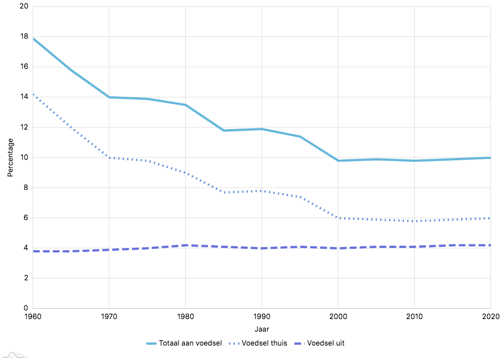

## Je dagelijks brood met brood verdienen

> '_For it is we who must pray for our daily bread, and if He grants it to us, it is only through our labour, our skill and preparation._' - Paracelsus

\label{desemdoos}

### Januari 2015

Een regelmatig wederkerend onderwerp in mijn notitieboekjes is het idee om zuurdesem (terug) onder de mensen te brengen. De website [redzuurdesem.be](https://redzuurdesem.be/) was een eerste logische aanzet. Op die manier kon ik mijn enthousiasme voor brood bakken met de wereld delen. Demonstraties en later uitgebreidere workshops waren stap twee. \nl
Ergens tussen analoog en digitaal zat echter nog een gat, een gat dat ik op een of andere manier probeerde op te vullen. Internet surfers aanzetten om brood te bakken vereist interesse, anders blijft het bij een kort bezoekje of in het beste geval het lezen van een artikel. Cursisten die deelnemen aan de workshop tonen die interesse door deel te nemen. Het is voor velen niet de eerste keer dat ze brood bakken. De beste leerschool is er eentje die beide werelden weet te combineren: theorie en praktijk. 

Het resultaat was ‘Desem Doos’: een tweemaandelijkse thuiscursus voor de ambitieuze broodbakker. Desem Doos was een concept dat beginnende bakkers in staat stelt in hun eigen keuken kennis te maken met zuurdesem. Het systeem werkte zoals andere bekende voedselpakketten die aan huis geleverd worden. Denk hierbij aan ‘Hello Fresh’ of ‘Supercraft’. Elke twee maanden werden er een aantal nieuwe recepten rond een centraal thema uitgedacht waar men mee aan de slag kan, geholpen met extra materiaal en video's. \nl
Dankzij de doos werd het mogelijk om thuis te experimenteren met zuurdesem. Ik wou de kennis die ik had opgedaan met iedereen delen in de vorm van een aantal digitale lessen. Desem Doos maakt integraal deel uit van mijn persoonlijke queeste naar beter brood.

Het idee om een doos te versturen klinkt misschien simpel, maar de uitwerking ervan heeft heel wat maanden werk gekost. Om mijn product op de markt te kunnen brengen moest ik een aantal belangrijke vragen beantwoord hebben. Hoe verstuur ik een actieve zuurdesemcultuur? Ik probeerde desem te drogen door veel water toe te voegen en het uit te smeren op een bakplaat. Na een dag is het water vedampt en kon ik met een vijzel de droge koek tot fijne poeder stampen. Het probleem met dit poeder is echter de activatiekost. Hier moet opnieuw water bij gemengd worden, mogelijks met nog een dag extra opkweek. Dat zou te ingewikkeld zijn voor cursisten. \nl
Ik moest er dus voor zorgen het pakketje zo snel mogelijk bij de ontvanger te krijgen. Weekends werden mijn grootste vijand. Er is niets zo rampzalig als een pakketje dat enkele nachten doorbrengt in een of ander pakhuis waardoor de desem te veel verzuurt. Achteraf gezien was het misschien toch beter geweest om zuurdesem te drogen. \nl
Zuurdesem was maar één dimensie van de logistieke puzzel. Ik moest aan een regelmatige, betrouwbare bron van bloem zien te geraken. Lotnummers, hygiëne, extra materiaal, een nieuwe website en betaalmethodes voorzien, reclame maken, wettelijk gezien in orde zijn, genoeg variatie aan leerstof voorzien, recepten testen en filmpjes maken, ... Ook al mikte ik maar op een dertigtal vaste klanten, toch bleek de uitwerking van Desem Doos veel tijd en energie te kosten. 

En bracht het iets op?

Hier komen we in de problemen. Het onderhoud van de website, het FAVV certificaat, en de sociale lasten zijn grote bedragen voor klein opstartend bedrijf in bijberoep. Een minimale winstmarge per doos maakte van mij niet bepaald een miljonair. Kortingen voor verpakkingsmateriaal, daar kwam ik niet voor in aanmerking: die beginnen pas vanaf een minimale afname van `1000` stuks. Dat maakte de doos met een sticker van het logo al snel erg duur, zelfs zonder inhoud. \nl
De verkoopprijs per doos was `30 EUR`. Gemiddeld werden er rond de 15 dozen gekocht om de twee maanden, of `450 EUR`. Verminder dat met `84 EUR` aan vaste kosten, en `273 EUR` aan totale verzendkosten. Dat leverde uiteindelijk `93 EUR` op. De balans is nog positief, maar nu vergeten we er eenmalige kosten bij op te tellen zoals de aanschaf van software, kosten aan materiaal om recepten uit te werken, de tijd zelf om alles samen te stellen, de aanschaf labeling- en lamineermachines, enzovoort. \nl
Ik heb verschillende keren getwijfeld om de verkoopprijs per doos te verhogen. Uiteindelijk zag ik af van die beslissing omdat ik van collega’s en vrienden de opmerking kreeg dat het niet goedkoop was voor ‘gewoon wat bloem’. Wat iedereen over het hoofd zag is de eigenlijke inhoud: _de leerstof_. Bloem is overal te koop, het was hem voornamelijk om de desem en de lessen te doen. \nl
Een marktonderzoek leverde mij misschien meer inzicht op over de bereidwilligheid van mensen om hier meer voor te betalen, maar zo slim was ik toen niet. 

Administratie verslond tijd die ik liever in het maken van recepten stak. Ik was alleen nog maar bezig met verpakken, mails te beantwoorden, en verloren zendingen terug te zoeken (bedankt DPD!). Als ik die feiten combineerde met de balans van mijn boekhouding was de conclusie snel gemaakt. \nl
Na een jaar break-even draaien gaf ik er de brui aan. Zo’n concept in leven blijven houden moet voor mij persoonlijk ook nog motiverend genoeg blijven om het na mijn uren als programmeur te willen blijven doen. Ik ben heel tevreden met het afgelegde traject. Zeker als ik kijk naar het aantal mensen die ik heb leren kennis maken met zuurdesem en de extra workshops die ik heb mogen geven dankzij dit initiatief. \nl
Een lepe verkoper vertelde mij eens ‘_ondernemen is de markt lezen_’. Ik had helemaal niets gelezen, en moest ik dat wel gedaan hebben, dan was ik er waarschijnlijk nooit aan begonnen. 

Mijn ‘eerst doen, dan denken’ attitude heeft me al veel rijke ervaringen zoals deze opgebracht. Ik probeer er een gewoonte van te maken om zo vaak mogelijk te vallen. Anders kan je toch ook niet terug opstaan? \nl
Ik ben er zeker van dat ik het slimmer had kunnen aanpakken door beter mijn huiswerk te doen. Ik kende niets van marketing, verkooptechnieken, en administratie van een zelfstandig bijberoep. Nu kan ik zeggen dat ik (nauwelijks) iets ken van marketing, verkooptechnieken, en administratie van een zelfstandig bijberoep. Ik ken er weinig van en ik ben er niet goed in, maar tevreden klanten die dit op Facebook posten geven me de kracht om het te blijven doen:

> ‘_Hey Wouter, sinds jouw workshop bak ik wekelijks mijn zuurdesembrood, en ik wil zelfs geen ander (gist)brood meer. Het is zoveel smaakvoller en beter verteerbaar dan alle gist-varianten. Ik kan het iedereen aanraden!_’

Ik wilde meer leren over het commerciële aspect van de bakker. Tijdens de avondschool kwamen we hier heel vluchtig in aanraking mee: inkoopprijzen, verkoopprijzen, winstmarges. Maar hoe duur moet een brood zijn om van te kunnen leven? Hoeveel broden per dag moet een bakker verkopen om met een gerust hart te kunnen gaan slapen? Ik had een vaag idee van aantallen door mijn stage en interviews met bakkers. \nl
Ik herinnerde me het bezoek van Dimitry Lysens en Johan Haiverlain aan De Superette. Dimitry baat samen met zijn vrouw Aagje Moens restaurant Magis uit in Tongeren. Johan is verantwoordelijk voor de bistro boven het restaurant, genaamd Bis. Ze waren reeds een tijdje aan het experimenteren met zuurdesembrood. Ik besloot te polsen naar hun vooruitgang om een bakkerij concept uit de grond te stampen. 

### Februari 2016

Bij te veel restaurants wordt een snee boerenbrood geserveerd waarvan het zicht en de smaak afbreuk doet aan het eigenlijk gerecht. Wie kiest er nu voor een smaakloze 'afgebakken' _baguette_ bij zijn pasta als er veel betere opties beschikbaar zijn? Gaat je honger ook spontaan over als je een plat broodje voorgeschoteld krijgt dat 'ik ben smaakloos!' schreeuwt? Wegwerken met genoeg boter is een optie. In de betere restaurants, zoals de sterrenzaak Magis, zijn de verwachtingen veel hoger. 

‘Ook gebeten door het zuurdesem virus heb ik gehoord?’ vraagt Johan terwijl we kennis maken. Zo zou je het kunnen noemen, ja. \nl
‘We willen voedzaam brood serveren. Brood met pit, met karakter. Zoals dit brood met kamut dat je lichaam helemaal zuivert!’ Johan overhandigt mij een stuk brood. Ik bevind mij in de bistro waar we afspraken om wat te praten over brood. \nl
‘Erg lekker. Plakt ook goed. Veel water gebruikt?’ vraag ik. Het doet me denken aan een combinatie van De Superette en Tilburg Sourdough[^tilb]. Niet verwonderlijk, aangezien ze met een slap deeg werken en bloem aankopen van de Commandeursmolen[^cmolen], net zoals in Tilburg. \nl
‘Goh ja, `70` tot `80%`. Het hangt erg van de bloemmengeling af. Kamut pakt gigantisch veel water op!’ Johan zijn lichaamstaal spreekt boekdelen: deze man straalt passie uit. Hij is chef, maar een echte bakker in hart en nieren, zegt hij trots. \nl
‘Ik heb er al veel over gelezen, over de gezondheidsvoordelen van oude granen als kamut. Ongelofelijk. Het is heel voedzaam, niet zoals een doorsnee wit brood.’ Als ervaren chefs beschikken Johan en Dimitry over een grondige achtergrond in de voedingsindustrie. Ik had zelf een brood gebakken en vroeg Johan wat hij ervan vond. Het was een redelijk donker roggebrood wat onmogelijk te vergelijken is met iets als tarwe of kamut. \nl
‘Ook goed zeg!’ Mompelt hij tussen het knabbelen door. \nl
‘Kom, we zullen eens beneden naar de keuken gaan. Dimitry is net bezig met het vormen van het brood.’ Hij pakt mijn brood mee en samen lopen we naar de keuken van Magis. Daar maak ik kennis met Dimitry, die volop bezig is met deeg.

[^tilb]: 'Tilburg Sourdough' was een bakkerij concept gestart door twee uitgebluste ITers, dat ondertussen uitgebreid werd naar lunchroom 'Pig & Rye'.
[^cmolen]: De Commandeursmolen ligt in Nederlands Mechelen, achter Maastricht. Het is aangedreven door water, en een van de weinige molens in de buurt die grote hoeveelheden op steen gemalen meel kan leveren, inclusief roggebloem. 

Mijn handen jeuken. Ik zie een twintigtal rieten rijsmandjes naast hem op de inoxen werktafel. Het is er druk: koks zijn volop bezig met de voorbereidingen van de avondservice. \nl
‘Dit gebeurt letterlijk tussen de soep en de patatten. We hebben nog wat moeite om de juiste plaats te vinden om het brood te doen rijzen. Het tocht te veel op die plek en het is te warm op een andere plek. We hebben niet zoveel ruimte tot onze beschikking, dit is immers een keuken, en geen bakkerij.’ Dimitry geeft een korte rondleiding. \nl
‘Hier vanachter hebben we plaats voor het kneden en bakken.’ Voorbij de gasvuren, de heteluchtovens, en de koelkasten kom ik in een ruimte terecht waar een spiraalkneder en een steenoven met twee verdiepen staat. \nl
‘De oven is nog nieuw voor ons, pas aangeschaft. We zijn nu aan het zoeken hoe we die het beste kunnen instellen voor ons brood.’ \nl
‘Zijn jullie pas begonnen met brood bakken dan?’ vraag ik. Dimitry schudt zijn hoofd.
‘Al enkele jaren, maar op heel kleine schaal. In gietijzeren potten in de heteluchtoven. Daar gaan er maar 6 tegelijk in. Teveel gedoe. We willen dit verder uitbreiden naar 36 broden bakken per keer.’ Johan laat me de lunchmenu van de bistro zien. \nl
‘Hier zijn we onlangs mee begonnen. Er is lunch voorzien op vrijdag- en zondagmiddag. Het is momenteel nog aftasten en enkel op reservatie. We zijn normaal ‘s middags niet open.’ Ik zie zuurdesem pizza en een bescheiden variatie van open sandwiches op het menu staan. 

Er wordt twee keer per week gebakken om voldoende brood te kunnen hebben voor het restaurant en de bistro. Er zijn ook plannen om het brood te verkopen als het experiment succes blijkt te hebben. Het idee is ontstaan toen Dimitry en Johan een fermentatie workshop volgden in Stockholm. Er werd niet alleen over groenten inleggen gepraat, maar ook een excursie gemaakt naar ‘Bageriet Brød’[^bag], een zuurdesem bakkerij in de buurt. Eenmaal de smaak te pakken (letterlijk dan) zijn Dimitry en Johan begonnen met experimenteren in Tongeren, met behulp van de bekende boeken van Chad Robertson [@tartine]. \nl
Hun desem starter bestaat voor `80%` uit tarwebloem en `20%` uit tarwemeel en is redelijk loperig. Die wordt op een zeer hoge temperatuur gehouden: tussen de `30` en `35° C`. De hoge temperatuur en humiditeit is verantwoordelijk voor die typische zoete melkzuur geur. Ze maken ook gebruik van een nachtelijke fermentatie in de koelkast, in rijsmandjes. \nl
‘Johan is twee dagen gaan meedraaien in de bakkerij in Stockholm. Er is superveel goed brood in die stad[^diestad]. Hun moederdeeg is heel warm. Ik zoek altijd een geschikte plek om onze starter de juiste temperatuur te geven.’ Dimitry haalt het potje van de kast en laat mij er aan ruiken. \nl
‘Dit ruikt zoals de gefermenteerde degen van De Superette, die waren ook redelijk warm. Zoet.’ Ze waren tijdens mijn stage op bezoek in Gent om Sarah wat tips te vragen. 

[^bag]: [https://www.instagram.com/bagerietbrod/](https://www.instagram.com/bagerietbrod/)
[^diestad]: Lees hier meer over in het artikel '_Why is Stockholm obsessed with sourdough_': [https://www.norwegian.com/magazine/features/2013/02/why-is-stockholm-obsessed-with-sourdough](https://www.norwegian.com/magazine/features/2013/02/why-is-stockholm-obsessed-with-sourdough)

‘Er zijn nog een hoop dingen waar we meer controle over willen krijgen’, zegt Dimitry, terwijl hij zijn kamut broden vormt en in mandjes legt. \nl
‘De koelkast van het restaurant staat op `1` tot `2° C`, het brood rijst veel moeilijker zo. Ik kan het niet maken om dit hoger te zetten vanwege vlees en we hebben nog geen aparte koelkast’. Brood dat ik thuis bak laat ik bijvoorbeeld een nacht rijzen op `7° C`, maar dat is natuurlijk mijn eigen koelkast, en ik heb geen restaurant (en vlees noch vis). \nl
‘Ons kneedmachine kan maar een deeg van `4 kg` aan, dus we moeten dingen in twee-drie keer doen als we een ander brood willen bakken.’ Het is een beetje goochelen met beschikbare ruimte in de keuken. De Superette is ook een restaurant, maar heeft een afgebakend stuk gereserveerd als bakkerij, wat bij Magis ontbreekt. \nl
‘Worden alle broden verwerkt in jullie gerechten?’ vraag ik. 36 broden twee keer per week bakken lijkt me een grote hoeveelheid gegeven de beperkte openingstijden. \nl
‘Nee, het brood is ook zo te koop.’ Aha. \nl
‘En hoe bepaal je de prijs van een zuurdesembrood? Daar steekt toch wel wat tijd in...’ vraag ik. \nl
‘Tja, het brood onder de `4 EUR` verkopen is waanzin. We stoppen er inderdaad veel tijd in, en de lokale biologische bloem van de Commandeursmolen heeft ook zijn prijs. Hier in Tongeren is er nog niet veel vraag naar. Niet iedereen is bereid om meer te betalen dan in de twee Vangrootloon winkels[^vgl] hier in de buurt. Ik wil er genoeg voor hebben. We zullen zien.’ Dat klinkt alsof een marktonderzoek aan de orde is. \nl
‘Daar zijn we niet mee bezig. Bakken is een passie voor Johan en mij, en het brood gebruiken we in eerste instantie zelf in onze eigen zaken. Wij zijn onze eigen grootste afnemer. De rest komt later wel.’ 

[^vgl]: Een industriële koude bakker. Ter vergelijking: anno 2019 kost een gemiddeld brood van `900 gr` daar `2.40 EUR`. Op hetzelfde tijdstip als dit interview zal dit wellicht enkele eurocenten minder geweest zijn. 

Ik heb hetzelfde dilemma in Gent gezien. Het brood is er ook veel duurder dan de gemiddelde bakkerij: `4.5 EUR`. In Hasselt wordt tegenwoordig datzelfde Superette brood, gebakken in Genk, verkocht voor `6 EUR`. En dat is niet onlogisch gezien de duur van het proces en de prijs van lokaal biologisch meel. Zuurdesembrood van dat kaliber is een compleet ander product dan gistbrood. De smaak, geur, en textuur zijn onvergelijkbaar, dus waarom zou de prijs dan vergelijkbaar moeten zijn? Mensen moeten echter wel bereid zijn om dit te willen betalen. Veel vrienden en familie zijn dit niet. Ik ken in feite maar weinig mensen die bereid zijn om veel geld uit te geven aan goed voedsel in het algemeen. \nl
Dat is niet alleen érg jammer, maar ook een groot maatschappelijk probleem. Statistische rapporten tonen aan dat de gemiddelde Amerikaan tegenwoordig ongeveer `10 %` van zijn inkomen uitgeeft aan voedsel [@clauson2008despite]. Figuur \ref{percincome} visualiseert gespendeerd inkomen aan eten de laatste 60 jaar[^figincome]. Volgens Eurostat is dit in 2017 met `12.2%` voor de gemiddelde Europeaan niet erg verschillend. In 1960 was dit percentage rond de `20%`, en in 1900 kwam dit ruim boven de `40%`. Hoe komt het dan in honderd jaar tijd dit zo sterk gedaald is? Dat heeft niet alleen te maken met de overvloed van tegenwoordige vrijetijdsactiviteiten waar we ons geld aan kunnen spenderen. Voor een groot deel is dit gewoon omdat men vroeger _bewuster_ omging met voedsel. 

{ width=80% }

[^figincome]: Dit is ruwweg gebaseerd op gegevens van het USDA, Economic Research Service, Food Expenditure Series, tabel 7. [http://www.ers.usda.gov/data-products/food-expenditures.aspx](http://www.ers.usda.gov/data-products/food-expenditures.aspx)

Ook al kosten luxe producten als een geïmporteerde avocado (`1.40 EUR`), een doosje hand geplukte Bosnische cantharellen (`5.50 EUR`) en zuurdesembrood (`6 EUR`) proportioneel gezien véél meer dan vroeger, toch zijn we er om een of andere reden in geslaagd om het budget dat naar voedsel gaat te halveren. We kopen tegenwoordig meer voedsel voor minder geld, en we spenderen er minder van ons inkomen aan. De vraag is alleen of dat 'voedsel' ook echt _voedsel_ is. Hoe meer we verdienen, hoe meer er beschikbaar is om te besteden aan eten. \nl
Toch zullen we een kleiner deel van ons totaal inkomen uitgeven. Als middenklassers zijn de meeste van mijn kennissen niet bereid om `6 EUR` te betalen voor goed brood. We worden niet alleen rijker, maar ook gieriger - en zieker. Dit heeft niet alleen te maken met de bereidwilligheid om een redelijk deel van je inkomen te spenderen aan gezond eten, maar ook met de hoeveelheid tijd die je steekt in de bereiding van dat eten. Een vragenlijst samengesteld door Pablo Monsivais en anderen geeft aan dat meer tijd spenderen aan de bereiding van voedsel gepaard ging met een verhoogde kwaliteit van je dieet [@monsivais2014time]. Dat werd gebaseerd op inname van groeten en fruit. Minder dan een uur per dag besteden betekende vaak meer bezoekjes brengen aan fastvoodrestaurants. Hun conclusie? 

> _Time might be an essential ingredient in the production of healthier eating habits among adults._

De beste oplossing is dus gewoon om de tijd te nemen je brood zelf te bakken.

Het meeste brood van De Superette wordt in de verschillende zaken van Kobe Desramaults zelf verwerkt. Dat slim systeem overtuigt klanten van het restaurant gedeelte, die hoe dan ook brood voorgeschoteld krijgen, om na de maaltijd toch nog even te stoppen aan de toonbank van het bakkerij gedeelte. Sarah vertelde dat de bakkerij waarschijnlijk niet kon overleven zonder het restaurant. Deze twee concepten met succes weten te combineren levert niet alleen lekkere gerechten op, maar zorgt er ook voor dat brood verkocht geraakt. 

Voor de welvarende mens van West Europa stelt de kostprijs van een brood niet veel meer voor, of het nu over twee of zes euro gaat (het geld effectief _willen_ besteden is een andere zaak). \nl
Dat is niet altijd het geval geweest, en zorgde vaak voor nationale crisissen, uitbraken van rellen en zelfs moorden. Er zijn bibliotheken vol boeken geschreven over de broodbakgeschiedenis van gildes in Parijs [@kaplanbakersparis] tot invloed op de Britse economie [@petersen2017bread]. Het veiligstellen van een voldoende aanbod aan brood was tot voor kort een zaak van algemeen belang. De woorden van de Romeinse dichter Juvenalis, _panem et circenses_ of brood en spelen, zijn eeuwenoud maar nog steeds erg actueel. Het gaat niet over vlees, vis, eieren of melk. Het gaat over brood: ons dagelijks brood. We vergeten de dag van vandaag welke implicaties de verandering van technieken in het malen en bakken hebben gehad op de maatschappij.

### April 2019

In april 2019 leerde ik toevallig via een voedselbewuste vriendin van Kristien dat Johan inmiddels zijn eigen bakkerij in Tongeren heeft geopend, genaamd '\mbox{Brijosh}'. Dat was voor mij reden genoeg om er opnieuw naartoe te rijden. Johan renoveerde een aanpalende ruimte van zijn woning om er twee ovens en een koelkast in te kunnen plaatsen zonder verlies van te veel werkoppervlakte. De bakkerij is open van donderdag tot en met zondag, en er wordt uiteraard voornamelijk zuurdesembrood verkocht.

'Hey Wouter, kom binnen jong!' Johan stond op het punt om roggebrood uit een van de ovens te toveren. Zijn joviale en uitnodigende persoonlijkheid moedigde aan om me onmiddellijk op mijn gemak te voelen, en we praatten wat. Ik vroeg hem naar de ovens die ik van formaat herkende. Het waren kleine, ronde houtovens met twee horizontaal roteerbare stenen verdiepen. Onze vroegere overbuur bakte brood in zijn schuur, waar exact dezelfde oven stond. \nl
'Moet je de assen eruit halen voordat je kan bakken?' vroeg ik, denkend aan de oude houtoven van Bokrijk. \nl
'Nee, in de onderste klep steek je het hout. Ik kan het u laten zien hoor, wacht.' Johan opende de klep zodat ik de gloeiende kolen kon zien. Hij gooide er wat hout bij op. Een metertje op de oven gaf iets meer dan `200 °C` aan. \nl
'Dit hout is echt geweldig. Ik ken een trappenmaker hier in de buurt, die mij overschot aan hoge kwaliteit eikenhout kan leveren. Dat brandt volledig op, geeft het langste en meeste hitte af, en het minste roetdeeltjes.' Hij glimlachte breed. \nl
'Andere mensen zouden nogal opkijken, wat ik hier opstook kan in feite nog dienen om meubels mee te maken!' \nl
'Stralingshitte is wat ik nodig heb,' gaat Johan verder. 'Ik begin bij rond de `280 °C` en zak stilletjesaan tot in de `200`. Dan is het tijd om bij te stoken. ' \nl
'Maar dat duurt misschien lang om op te stoken?' \nl
'Drie kwartier.' \nl
'Amai dat is snel. Mijn elektrische oven heeft anderhalf uur nodig.' Johan begint te lachen. \nl
'Daar gaat uw stroomleverancier blij mee zijn.' \nl
'Niet bepaald, we hebben zonnepanelen gelegd' grijns ik. 

'En die _deck oven_ in Magis, gebruiken jullie die niet meer?' \nl
'Jawel hoor, die staat daar nog. Ik bak hier brood, ook voor de bistro, en Dimi bakt zijn eigen brood. Ik doe dit hier in bijberoep. Nu heb ik mijn eigen ruimte, dat ging niet in het restaurant. Klanten die een brood komen kopen moeten dan door de keuken lopen, dat gaat toch niet? Er was ook te weinig ruimte, dus besliste ik om het gewoon thuis te doen.' Johan haalt zijn schouders op en kijkt rond. Ik volg zijn voorbeeld. \nl
'Genoeg ruimte hier!' glimlacht hij. Inderdaad. \nl
'En verkoop je ondertussen genoeg? Is het populair, hier in een deelgemeente van Tongeren?' \nl
'Weet je, eens als je wat naamsbekendheid hebt opgebouwd, dan volgt uw harde kern van vaste klanten wel. Ik ben begonnen als traitteur, en ben ondertussen zeven jaar met bistro Bis bezig. Daar is reclame maken belangrijk. Alles moet _flashy_ zijn om de aandacht te trekken. Dit hier is iets anders, mijn eigen ding. Ik zou het graag willen uitbreiden, met een lange tafel of zo. Dingen serveren voor bij het brood. Daarvoor moeten we eerst nog meer verbouwen.' \nl
'Ja, want die combinatie tussen verbruiken en verkopen blijkt goed te gaan hé, zo deden ze het ook in Gent. Je krijgt een gerecht met lekker brood, en denkt, dat moet ik meenemen naar huis!' herinnerde ik mij. \nl
'Zeer zeker! Dat wil ik ook nog doen, maar op kleine schaal. We zien wel.' zegt Johan.

'Hoeveel broden krijg je gebakken in deze ovens?' Ik wijs naar beide ovens. Eentje ziet er veel nieuwer uit. Die blijkt beter geïsoleerd te zijn. Ik sta korter bij de oudere oven, die duidelijk meer hitte afgeeft. Alle warmte is welkom, het is buiten `10 °C` en het regent. \nl
'Ik bak ongeveer 20 broden per uur. Dat gaat goed. Er staat nog deeg klaar in rijsmandjes in de koeling. Het is voorlopig genoeg. We zien wel.' De ontwapenende glimlach bekrachtigd zijn gemoedelijke _we zien wel_. \nl
'Lukt het ondertussen al beter met de _high hydration_ methode?' vraag ik. \nl
'Behalve dat spelt hier,' begint Johan, terwijl hij klopt op een erg plat gebakken brood op het koelrek. ', gaat het goed. Weet je, ik sta al veel verder sinds uw vorig bezoek. Toen bakten we echt volgens stricte regeltjes, om te kunnen bijsturen als er iets misloopt. Dan dat, zoveel van dat, _tjak tjak_. Nu doe ik veel meer op mijn gevoel. Ik weet zelfs niet eens exact hoeveel van wat er in gaat.' Ik knik, denkend aan mijn eigen evolutie in de stiel. \nl
'Behalve dat spelt dus. Vorige zomer, in 2018, was veel te heet. Ik bak nu met die oogst, en heb al vanalles geprobeerd. Veel minder water en zo. Maar het is zo rekbaar, en zo snel té ver gegist. Da's te plat hé. _Overfermentatie_ is dat hé.' Ik zie achterin zakken van de Commandeursmolen liggen. Johan knikt. \nl
'Ja, nog steeds. Dat meel is echt goed. Maar ik heb nu contact met een lokale boer die spelt teelt. Misschien kunnen we het lokaal malen.' _We zien wel._

Toen ik vroeg naar zijn zuurdesem, was Johan zelfs zo vriendelijk om zijn hele broodbakmethode gedetailleerd te beschrijven. \nl
'Kijk, Da's is mijn _leaven_. Die staat nu ongeveer twee uur. Bijna klaar, zie ik.' Hij opent een grote doos vol loperige zuurdesem. Ik ruik voornamelijk de zoete toets van tarwe, en nauwelijks een spoortje van azijnzuur. \nl
'Twee uur? Wow die is snel klaar! Ik laat die thuis twaalf uur staan.' Maar daar is het veel kouder dan in deze warme bakkerij. \nl
'Is dat volledig volkoren tarwe, of nog steeds half/half?' vraag ik. \nl
'Dat hangt af van het seizoen, omdat het in de zomer nog sneller werkt. Ik wissel de verhoudingen af tussen de `80:20` en `50:50`.' \nl
'En de rijstijden?' \nl
'Eerste rijs twee tot drie uur met een keer of twee plooien tussenin. Ik begin dadelijk te kneden als dit hier op punt staat.' Johan schudt met de doos vol zuurdesem. \nl
'Rond vier of vijf uur in de namiddag gaat alles in rijsmandjes de koeling in, om 's morgens vroeg te bakken.' 

Johan zijn broden zijn tien uur sneller klaar dan de mijne, vanwege de erg snelle gisting van het voordeeg. Dit proefde ik ook in de broden die ik kocht van hem. De uitgesproken maar aangename zoete smaak van gegiste tarwe overheerst. Geen nasmaak, en geen azijn. Mijn brood is vanwege de extra rijstijd en de gekoelde zuurdesemcultuur heel wat pittiger. Ik denk dat brood van Brijosh gepast is om mensen te leren zuurdesem eten. De veelzijdige smaak is ook geschikter om in gerechten van zijn bisto in Tongeren centrum verwerkt te worden. 

'En jij Wouter, nog veel aan het bakken?' vraagt Johan. Ik vertel over mijn plannen voor het boek, en mijn voorliefde om anderen iets bij te leren. \nl
'Ken je _The Sourdough School_ van Vanessa Kimbell?' Ik knik, en Johan gaat verder. \nl
'Zoiets, zo bezig zijn met mensen iets bij te leren, als dat eens uw _core business_ is... Voor mij is een workshop eerder iets vervelends dat ik tussendoor doe. Ik geef soms dingen mee met de instructies het thuis dan maar zelf af te bakken omdat er hier geen tijd voor is. Maar als je van begin tot einde het hele zuurdesem traject kan laten zien, en de tijd neemt om daar een dag aan te spenderen... Dat zou toch geweldig zijn!' Dat zou het zeker... 

### November 2016

Mijn zoektocht naar commercieel inzicht leidde me tot in Bunnik, dichtbij Utrecht. Op het landgoed van Nieuw-Amelisweerd ligt bakkerij en keuken De Veldkeuken. Hier bakken René van der Veer en Juliette Borggreve hun biologisch brood. De naam ‘Veldkeuken’ is heel toepasselijk: de zaak ligt in een prachtig gebied omgeven door bossen, velden en wandelpaadjes. \nl
Het landgoed is opgedeeld in verschillende gebouwen. De bakkerij staat hier dus echt los van de keuken en ligt tien minuten stappen van elkaar af. De keuken neemt een stuk van het koetshuis in beslag waar aan de linkerkant een museum in gevestigd is. Het trekt veel hongerige bezoekers aan die tussen het wandelen door even willen uitrusten. \nl
We werden hartelijk ontvangen door Juliette en bestelden thee om de kou van de gure herfstdag uit onze botten te jagen. Na een blik op het menu zag ik dat de Veldkeuken zich toelegt op brunch, lunch, koffie en taart. \nl
‘Ik zal even René bellen die aan het werk is in de bakkerij, dan kan je er zo even langs gaan.’ Ik krijg als voorsmaakje een _levain couronne_ toegestopt, zuurdesembrood in de vorm van een kroon. De korst zag er alvast veelbelovend uit: diep bruin gebakken, en mooi opengebloeid in de oven. \nl
‘Kijk schat, mooi hè?’ Ik kon het niet laten om er eens aan te ruiken. Kristien trok een gezicht. \nl
‘Daar hangt zoveel bloem aan de bovenkant?’ wees ze. Dat duidt op het gebruik van rijsmandjes die slap deeg de nodige ondersteuning bieden bij het rijzen. \nl
Op de broodzak staat de volgende tekst:

> ‘_De Veldkeuken op Amelisweerd. Smaak, kwaliteit, ambacht en eenvoud. Dat vinden wij op het landgoed en in de streek. Groente, fruit en kruiden komen zo veel mogelijk uit de moestuinen van het landgoed. Kaas, melk, eieren, boter, kwark en (slag)room komen uit de directe omgeving van Amelisweerd.
De Veldkeuken gebruikt 100% biologische grondstoffen._’

‘Het is hier wel leuk om te zitten na die wandeling’ zei Kristien. Ik had haar gevraagd of ze het zag zitten om een uitstapje te maken naar een mooi natuurgebied in Nederland. Kon ik er wat aan doen dat daar toevallig ook een bakkerij lag? We dronken snel onze thee uit en vertrokken op aanwijzingen van Juliette naar de bakkerij. 

Het bakkerij gebouw vlak naast een wandelpad heeft grote ramen die bezoekers doen staren naar zwoegende bakkers. René zag ons staan en wuifde. Zijn handen waren lekker vuil van het plakkerig deeg. Hij schoof het raam open om ons binnen te laten. Er is niet zo veel bewegingsruimte in de huidige bakkerij[^plan]. René geeft ons een korte rondleiding en toont verschillende moederdegen die netjes onderhouden worden. \nl
Ook hij werkt met bloem van de Commandeursmolen die je in indrukwekkende stapels achterin de ruimte kan zien liggen. Er zijn nog twee andere bakkers aan het werk. Al fluitend worden er cakes in de oven geschoven en krentenbollen in de rijskast gepropt. Er hangt een ontspannen, gezellige sfeer. Ik ben onmiddellijk jaloers: de hectische sfeer die ik kende van De Superette is hier volledig afwezig. Ik neem aan dat dit komt door de strikte scheiding van keuken en bakkerij samen met de bekwaamheid van dit goed geolied team. 

Ik vraag René naar zijn grote kneder met één arm. \nl
‘Oh, die gebruiken wij nauwelijks. Die spiraalkneder daar wordt gebruikt.’ Hij wijst naar een hoek kortbij de oven. \nl
‘Is dat niet handiger omdat er meer in kan? En omdat het minder ruw werkt dan de snelheid van zo’n spiraalkneder?’ vraag ik. De spiraalkneder die we in de avondles gebruikten gaf gevaarlijk veel warmte af aan het gekneed deeg. \nl
‘Dat klopt, maar wegens plaatsgebrek is dat voor ons momenteel niet de beste optie. Deze muur staat in de weg en aan de oven hebben wij geen centimeter ruimte meer vrij.’ Altijd zeulen met zoveel deeg is niet leuk. \nl
‘Hetzelfde probleem met de rijskast in feite. We kunnen het instellen als remkast op lage temperatuur, of als rijskast op hoge temperatuur. Maar we hebben er zo maar ééntje. Het is een beetje puzzelen om alles perfect in elkaar te laten passen.’ \nl
‘En hoe gaat de verkoop? Dit landgoed ligt niet erg centraal, het is toch even fietsen vanuit Utrecht. Merken jullie daar iets van?’ vraag ik. René knikt. \nl
‘Het brood wordt verkocht in het gebouw van de keuken zoals jullie ongetwijfeld al gezien hebben.’ \nl
‘Ja, ’ onderbreek ik, ‘en de prijzen vallen heel goed mee. Volgens mij mag het gerust duurder geprijsd worden hoor. `3.60` EUR voor een desem brood van `900 gr`?’ \nl
‘Eerder `800`. Welja, we verkopen het brood via andere verkooppunten. Die winkels nemen hun eigen winstmarge daar nog eens op dus dat is weer net iets duurder. Ik wil het niet te duur maken voor de mensen die de moeite nemen om tot bij ons te komen. We hebben zo heel wat vaste klanten, tegen alle verwachtingen in.’ 

[^plan]: Er waren toen wij De Veldkeuken bezochten in 2016 plannen om aan uitbreiding te doen, eventueel op een andere locatie. 

De Veldkeuken combineert verschillende ideeën om het brood te verkopen. Om te beginnen is de keuken opnieuw een grote afnemer van hun eigen brood, zoals bij Magis in Tongeren of De Superette in Gent. Ondertussen ben ik ervan overtuigd dat voor deze zaken die bepaalde combinatie de belangrijkste factor voor hun succes is. Ook hier vertrekken veel wandelaars niet alleen met een gevulde maag, maar ook met een broodzak onder de arm. \nl
Daarnaast wordt het brood verder gedistribueerd door winkels in het centrum van Utrecht. Die bestelwagen met het logo van De Veldkeuken staat niet voor niets op de oprit van het bakkerij gebouw. René en Juliette hielden er trouwens twee vestigingen op na: in het domein te Amelisweerd waar de bakkerij ligt, en in het forthuis van Werk aan het Spoel te Culemborg. De laatste locatie sluit eind 2016 om alle aandacht te kunnen richten op de uitbreidingsplannen van de biologische bakkerij.

Ik ben onder de indruk van de hoeveelheid desems die René en zijn team actief onderhouden. Ze maken een onderscheid tussen _zuurdesem_ en _desem_: een _zuurdesem_ is in hun ogen een natuurlijke gisting van de bloem met melk- en azijnzuren, en een _desem_ is datzelfde zonder de azijnzuren. Dat is opmerkelijk omdat de naam 'desem' vaak gebruikt wordt om een droge volkoren tarwedesem aan te duiden die meer azijn- dan melkzuren bevat. \nl
De professionele desem wordt in grote flessen aangekocht en is bijna zo vloeibaar als room. Ik vermoed dat deze desem van een handelaar als Puratos komt. Het ander moederdeeg, de _zuurdesem_, is zelf opgekweekt. Net als veel andere bakkers heeft René de kneepjes van het vak in Frankrijk geleerd. 
Als we het hebben over de leerstof, bevestigt René mijn ervaring. \nl
‘Dat is hetzelfde hier in Nederland, ’ knikt hij. \nl
‘De opleiding stelt weinig voor.’ Het is jammer om te horen dat dit probleem zich ook buiten België stelt. \nl
‘In Duitsland komt zuurdesembrood vaker voor. Maar veel bakkerijen gebruiken industriële zuurdesempoeder als smaakmaker in combinatie met gewone gist. Soms wordt zelfs azijn toegevoegd om de roggebroden die karakteristieke zure smaak te geven. Dat is niet bakken, dat is bedriegen.’ Consumenten worden constant belazerd, of het nu in de supermarkt is of in de bakkerij.  

De enige oplossing die ik zie is bewust bezig zijn met voeding. Zo veel mogelijk te weten komen over wat er nu precies je maag binnen komt. Kritische vragen stellen als 'Wil ik dit wel eten als ik weet dat het op die manier gemaakt wordt?' of 'Sta ik hier wel achter?' Het is niet enkel een gezondheidskwestie, maar ook een belangrijke morele keuze. \nl
Ik eet graag brood, dus ik leerde wat goed brood was en wat niet. Op die manier kan ik beter de keuze maken om iets op te eten of het te laten liggen. Bakkerijen als De Veldkeuken verkopen hun brood duurder, maar als je weet wat daarachter zit ga je hopelijk wel bereid zijn om een euro meer te betalen. En dan zijn er altijd afzetters die hun brood aanprijzen als hét gezondheidsmiddeltje, terwijl het eigenlijk geen haar beter is als brood van de supermarkt. Ik wapen mij tegen die oplichters met kennis. \nl
Softwareontwikkelaars zeggen vaak ‘meten is weten’ om de nadruk te leggen op het onderzoekende aspect voordat actie ondernomen wordt. In de context van voedsel kan ik ook zeggen: _weten is eten_. 

De bakkerswereld blijkt trouwens een erg klein wereldje te zijn. René en ik praatten over goede andere bakkerijen en we kwamen tot de conclusie dat onze voorkeur op één lijn ligt. Als het woord ‘Parijs’ valt, komt direct ‘Du Pain et Des Idées’ ter sprake. \nl
‘We zijn een paar keer in De Superette geweest. We hebben een boek en brood van ons geruild met exemplaren van hun. Dan heb je zeker een goede basis gelegd met je stage daar te doen.’ Daar denken we hetzelfde over. De Veldkeuken is dan misschien een kleine bakkerij en ligt dan misschien op een landgoed in plaats van in een hip stadscentrum, toch komen er regelmatig internationale collega’s over de vloer om kennis uit te wisselen. 
René vertelt dat hij wel eens met het idee gespeeld heeft om een conventie uit de grond te stampen. \nl
‘Maar dat kost erg veel energie. Voorlopig blijft het bij wilde ideeën. Eerst hier uitbreiden.’ Ik vind het geweldig dat er zo’n sympathieke mensen zijn die naast hun veeleisende job ook nog bezig zijn met kennisverspreiding. Dit is verre van de norm in die wereld. Veel bakkers reageren heel defensief wanneer ik vraag om een kijkje te mogen nemen in hun bakkerij. ‘Ik heb ook alles zelf moeten leren, niemand moet mijn kennis komen stelen!’ is de standaard reactie. Daar wordt niemand beter van... 

Tot nu toe heb ik verschillende strategieën van bakkers gezien om desem meer onder de mensen te brengen. Met behulp van een eetgelegenheid aan de bakkerij zelf, via kleinhandelaars en markten, en natuurlijk zelf verkopen. \nl
Naamsbekendheid speelt vast en zeker ook een rol. Zowel De Superette als De Veldkeuken hebben ondertussen een kookboek uitgebracht waar een groot aantal pagina’s exclusief gereserveerd zijn voor zuurdesembrood. Elke zichzelf respecterende chef-kok verkoopt zijn restaurant in de boekhandel en zorgt op die manier voor een extra toestroming van klanten. \nl
Bakkers met een duidelijke visie zijn actief bezig met kennisverspreiding. Niet alleen door een boek te schrijven, maar ook door nieuwe concepten uit de grond te stampen, workshops te geven, open te staan voor stages, bakkerijen van collega’s te bezoeken en samen te komen om tips te delen. 

Ik heb mijn zoektocht bewust beperkt tot bescheiden biologische bakkerijen. Om écht inzicht te verwerven in het commerciële aspect werd het tijd om me te wenden tot de industrie. De voornaamste reden om iets op groter niveau aan te pakken is om meer te kunnen verkopen met minder moeite - en dus minder geld. Mijn nieuwsgierigheid won het tijdelijk van mijn weigerachtigheid om kennis te maken met enorme ruimtes die hele rekken sandwiches tegelijkertijd bakken.

### November 2013

In het industriepark van Sint-Truiden ligt Vangrootloon, een bescheiden bedrijfje die na honderd jaar uitgroeide tot dé grootste bakkerij van Belgisch Limburg. Het gebouw bestaat uit een gigantische hal, opgedeeld in secties waar men vlaaien, sandwiches, speculaas, en brood aan de lopende band (letterlijk en figuurlijk) produceert. Die band loopt van de productiehal tot in de vertrekhal waar het lekkers verdeeld en verpakt wordt om met behulp van tientallen vrachtwagens tot bij de verdeelpunten gebracht te worden. \nl
Vangrootloon levert niet alleen aan zijn eigen zaken, maar ook aan supermarkten en andere koude bakkers. Een Vangrootloon winkel is deels een koude bakkerij en deels een tearoom. De scherpe prijzen zorgen voor een constante toestroom van klanten die graag koffie bij hun stukje vlaai willen. \nl
De website trakteert ons op slagzinnen als ‘Ruim assortiment van producten: ieder zijn smaak’ en 'Een uitgebreid aanbod aan broden: proef ze allemaal’. En dat is niet gelogen: dit is een traditionele Belgische bakkerij zoals wij Vlamingen ze graag hebben. Veel geluk met het maken van je keuze. De fabriek is best indrukwekkend: bij elke stap van het bakken van taart komt een andere machine kijken, allemaal verbonden met dezelfde band. Het deeg rolt uit de ene machine en wordt keurig uitgestoken door de andere. Een gigantische drukketel kookt de banketbakkersroom en perst de vulling op de bodem. Niet te veel, niet te weinig. De band loopt verder tot aan de oven en hup: weer een vlaai gebakken!

Vangrootloon is een familiebedrijf dat in 1918 gebak verkocht met paard en kar. Ondertussen telt het bedrijf in 2019 meer dan 300 werknemers met 23 vestigingen in Limburg en Vlaams-Brabant. Het woord 'ambachtelijk' betekent voor hun werken met streekgebonden en seizoensgebonden producten. Een aardbeientaart wordt in tegenstelling tot bij veel bakkers enkel tijdens het seizoen verkocht. Het gebak wordt om vijf uur 's morgens in vrachtwagens geladen om diezelfde morgen in vitrines van lokale winkels te pronken. \nl
Vanwege de afstand wil Vangrootloon voorlopig niet verder weg leveren dan Leuven. Toch hebben ze klanten over heel België die indien het écht nodig is voorzien kunnen worden van diepgevroren producten, eerder als uitzondering dan als regel. 

Professionele kneedmachines zijn niet nieuw voor mij, maar grote hoeveelheden deeg zien voorbij rollen op een band om daarna netjes verdeeld en opgebold te worden wel. Zelfs de grote hoeveelheden die Sarah en haar team uit de oven in Gent tovert, stelt weinig voor in vergelijking met wat hier per uur gebeurt.\nl
Er komt geen kwastje aan de pas wanneer de sandwiches bestreken worden met ei: ze worden met behulp van perslucht besproeid in grote rekken, om daarna automatisch in ovens gerold te worden. Alles is tot in de puntjes verzorgd en overal is rekening gehouden met hygiëne. De verkoop van grote hoeveelheden maakt het mogelijk voor Vangrootloon om te kiezen voor een lagere prijsklasse. \nl
Dat lager prijskaartje komt echter toch met een verborgen kost: deze broden zijn gemaakt op _snelheid_, en niet op _smaak_. 

In principe kan men ook op grote schaal met enkel water, bloem, gist en zout lekker brood bakken. Het probleem zit hem in de totale doorvoer van de machines. Traag kneden betekent tijd verliezen, dus minder bolletjes deeg voorbij zien rollen op de band. Snel kneden en machinaal vormgeven oefent grote druk uit op het deeg dat het gluten netwerk doet scheuren. Dat is meestal een van de momenten waarop er vertrouwd kan worden op de toegevoegde additieven. \nl
Inconsistentie is de grootste vijand van de bakker die geen kans krijgt door frequente, hetzij minimale, wijzigingen aan het proces. De ene oogst is de andere niet. Handwerk, gevoel en ervaring spelen hier veel beter op in dan een lopende band. In dat geval is het weer de verbeteraar die de dag redt. 

Gelukkig is niet alles is volledig geautomatiseerd. Getalenteerde bakkershanden komen aan de pas bij onder andere het maskeren van taarten met _crème au beurre_ in de koude sectie. Bakkers in dienst bij grotere fabrieken zijn specialisten die zich toeleggen op één onderdeel van het proces. Vacatures worden niet uitgeschreven als 'broodbakker gezocht', maar als 'kneed expert gezocht' of 'verdeler gevraagd'. Die industrie trekt ook verdacht veel ingenieurs aan die de verantwoordelijkheid krijgen om het productieproces nog verder te 'optimaliseren'.

Veel geld verdienen kan dus met behulp van automatisatie en opzet van filialen, gegeven een voorafgaande grote investering. Ook al weten de machines een zekere indruk te maken, toch verliest 'ambachtelijk' bakken op zo'n grote schaal een groot stuk van zijn karakteristieke charme, ook al is de grootste bakkerij van Belgisch Limburg niets in vergelijking met volautomatische fabrieken die zo groot zijn als enkele voetbalvelden. Er ontbrak één belangrijk ding in de fabriek dat ik wel hoopte te vinden zo'n honderd kilometer meer naar het zuidoosten: _zuurdesem_. 

### Februari 2014 

\index{Lactobacillus!sanfranciscensis}

Het '_Puratos Center for Bread Flavour_' ligt in Duitstalig België, in een klein heuvelachtig dorpje genaamd Saint-Vith. De naam van het centrum belooft alvast veel. Ik werd er hartelijk ontvangen door Karl De Smedt, de communicatiemanager van de bakkerij afdeling. Karl reist heel de wereld rond op zoek naar nieuwe soorten zuurdesemculturen. Dit zijn mensen die uren kunnen blijven praten over bloem en gist. Ik was aan het juiste adres. \nl
‘Er zijn veel zuurdesem tradities over heel de wereld. De Grieken fermenteren hun desem met basilicum. In San Francisco werken ze met natte, warme desems. Die cultuur is uniek en bevat de melkzuurbacterie _Lactobacillus Sanfranciscensis_. In Alaska is het erg koud en werd desem vroeger tegen het lichaam gedragen. Lichaamstemperatuur geeft dan weer een andere bacteriecultuur. De omgevingsvariabelen samen met de bloem zorgen voor een unieke smaak.’ Puratos stuurt mensen zoals Karl op ontdekkingstocht om nieuwe bacteriesoorten mee naar huis te brengen. \nl
‘Wij werken samen met professor Marco Gobbetti die in zijn laboratorium in Italië alle gisten en bacteriën isoleert. Een rijke cultuur bevat meer dan duizend verschillende soorten. De volgende stap is de geïsoleerde organismen van verschillende culturen te combineren en zo de ideale nieuwe cultuur op te kweken. Zo ontwikkelen wij onze eigen zuurdesem producten. We beschikken momenteel over meer dan vierhonderd verschillende melkzuurbacteriën.’ 

We komen aan in een bakkerij die als testlab fungeert om te kunnen experimenteren met de gisten in het broodbakproces. Karl laat me verschillende poeder- en vloeibare desems ruiken en proeven. Ik ben verrast van het scala aan kleuren en smaken: van zoet naar zuur, van donkerbruin gekarameliseerd naar lichtgeel. \nl
‘Sommige producten worden als algemeen rijsmiddel verkocht. Anderen fungeren als specialist: die moeten dienen voor baguettes of voor zachte luxe. Door te spelen met de organismen kunnen we blijven proberen tot we de ideale combinatie ontdekt hebben.’ Mijn verwonderde blik doet Karl glimlachen. \nl
‘We hebben hier regelmatig bezoekers over de vloer die onder de indruk zijn. Hier komen bakkers op zoek naar de heilige graal om hun proces te optimaliseren, maar ook Aziatische managers van enorme ketens die smaak en technologie wensen te combineren.’ \nl
‘Kan ik ook een stuk brood proeven in plaats van de desem zelf? Dat geeft een completer beeld’, zeg ik, wijzend naar de netjes geordende stapel afkoelende broden in het rek. Karl schudt zijn hoofd. \nl
‘Sorry, die zijn voor een belangrijke demonstratie weggelegd. Ik had misschien iets extra moeten laten bakken… Maar hier, pak een zak van onze O-Tentic mee om thuis te proberen!’ Hij overhandigt me een zak van `2 kg` en ik bedank hem uitvoerig. \nl
Op de zak staat ‘_O-Tentic DURUM - Dosage: `4%`_’. De hoeveelheid geeft aan hoe je dit product dient te gebruiken. Het werkt als een vervanger voor gedroogde gist en voegt tegelijkertijd smaken van verschillende gecombineerde bacteriën toe die ontdekt zijn door de Marco Polo’s van zuurdesem. Ik heb er verschillende keren mee gebakken toen ik terug thuis kwam en moet bekennen dat het op korte tijd toch aardig wat smaak weet te introduceren. Die producten zijn immers gemaakt voor degen die onder de vier uur klaar zijn. \nl
Er zijn op internet nog andere bronnen om aan wereldculturen te geraken zoals Sourdoughs International[^sdnat]. Via die website is iedereen maar één klik verwijderd van een Finse, Russische of Australische gedroogde zuurdesemcultuur.

[^sdnat]: [https://www.sourdo.com](https://www.sourdo.com)

De gebouwen in Saint-Vith zijn overgenomen van een oude veehouderij. Wanneer Karl me verder leidt naar een van de bijgebouwen waar hun producten geproduceerd worden, vertelt hij: \nl
‘Dit was vroeger een boerderij. De machines die je nu hier ziet werden toen gebruikt om het teveel aan melk te verwerken tot melkpoeder. Dat is ideaal voor ons: wij verwerken het teveel aan zuurdesem ook tot poeder. Klanten kunnen kiezen of ze de desems vloeibaar kopen of niet. Door de grote luchtstroming droogt elk deeltje heel snel uit en bekomen we zo uiteindelijk het poeder.’ Sommige klanten kunnen niet kiezen als het op de wetgeving aankomt: in Frankrijk is er een wet die het gebruik van actieve desems verplicht. Puratos exporteert dan hun vloeibare producten. In Duitsland werken veel bakkers met wat Karl ‘opstartdesem’ noemt: desempoeder dat ook verkocht wordt in Duitse supermarkten. René van bakkerij De Veldkeuken bevestigde dit verhaal. \nl
Ik heb moeite om Karl te begrijpen door het lawaai van de machines. Puratos verkoopt geen vastere desems: alles is meer water dan bloem, over de `100%` hydratatie. Vloeibare desem maakt de verpakking en transportatie eenvoudiger. 

‘De meeste bakkers die onze desems kopen maken gebruik van een speciale machine om die op te kweken en op temperatuur te houden. Dat is eigenlijk een grote incubatie kast van inox met een kraan om desem af te tappen die in het brooddeeg gekneed wordt.’ Die machine had ik zien staan in hun bakkerij. Het is een groot ding dat door groothandelaars verkocht wordt onder de naam ‘zuurdesem productie machine’. Het inoxen ding schreeuwt industrie. \nl
Vanuit België vertrekken dus liters aan vloeibare desem die naar binnen- en buitenland stromen. Hoe kan Puratos wel de versheid garanderen die ik niet kon met mijn Desem Doos? Tijdens het wandelen van machine naar machine, antwoordt Karl: \nl
‘Goede vraag! Zuurdesems kan je opdelen in verschillende categorieën. Type I[^types] is de typische traditionele desem die door verversen in leven gehouden wordt.’ Dit is het type van desem die ik gebruikte in mijn doos. \nl
‘Dan heb je onze vloeibare desems, dat is type II. Een speciale fermentatie stap boven de `30° C` gecombineerd met een langere periode van rust zorgt voor een stabiele samenstelling die beter bewaart. Type II wordt gebruikt als natuurlijke verbeteraar. Je hebt nog altijd gist nodig die wij toevoegen aan het product.’ De stabilisatie van een desem vereist het gebruik van speciale apparatuur zoals grote drukketels. Ik kan thuis niet zomaar type II desem maken, ook al zou ik het willen. Het verlies aan goede rijskracht maakt voor mij deze soort zuurdesem niet erg aantrekkelijk. \nl
‘Dan heb je nog type III, dat is de gedroogde versie van type II. De bacterieculturen verschillen wel degelijk door het droogproces.‘ Het product dat ik meekreeg, O-Tentic, bevat ook gedroogde gist. 

[^types]: Lees hier meer over in een verslag over functionele en technologische aspecten van zuurdesem fermentatie [@yazar2012functional]. 

Er hangen verschillende informatieve bordjes in de ruimtes over fermenteren. Een bondige samenvatting in de vorm van een grafiek blijft me bij. De x-as gaat van droog naar nat en de y-as gaat van koud naar warm. Rechtsboven stond ‘LAB+’: meer _Lactic Acid Bacteria_ of melkzuren. Linksonder stond ‘AAB+’: meer _Acetic Acid Bacteria_. Hoe warmer en natter je desem, hoe meer melkzuren. Hoe kouder en harder, hoe meer azijnzuren. \nl
Zowel René als Sarah van De Superette maken handig gebruik van dit feit door hun desem op een lekker warm plaatsje te laten staan. Thuis heb ik er meer moeite mee omdat ik niet zoals professionele bakkers elke dag gebruik maak van mijn desem. Die leeft door de week in de koelkast op `7° C`. Azijnzuur is het logische gevolg daarvan. Dat los ik op door een dag op voorhand de desem verschillende keren aan te lengen met bloem en water. 

Ik vertel Karl over mijn opleiding en mijn ideaalbeeld om desem terug alledaags te maken. Hoe overtuig ik iemand van zuurdesem? \nl
‘Daar heb ik wel advies voor, moest je ooit beginnen met een micro bakkerij. Begin zoet. Mensen zijn geen complexe smaakpaletten meer gewoon. Probeer gradueel over te schakelen. Ververs je desem met korte periodes in een warme omgeving. Leer het ze eten!’ Hij neemt het potje met mijn zuurdesemcultuur dat ik had meegebracht nog eens vast en ruikt eraan. Een denkpauze volgt. \nl
‘Zoals je desem hier. Te veel azijnzuur. Zet hem eens op `24` tot `25 °C` en ververs vaker. Ook bij het verkopen van brood hebben mensen nog te veel het idee van een klassieke _boterham_ in hun hoofd. Brood moet voor hen gebakken zijn in een bakvorm en smeerbaar zijn. Geen grote gaten, oh nee, daar valt de chocopasta uit! Bak dan ook zo’n brood, maar dan met desem. Stapje per stapje overschakelen naar een rijke smaak.’ \nl
‘Bak jij thuis ook zelf brood met zuurdesem?’ vraag ik. Hij knikt bevestigend. \nl
‘Maar mijn vrouw heeft graag _sneekes_, zoals veel Vlamingen. Dus bak ik gewoon in een bakvorm. Maar wel met desem!’ Een knipoog. Lepe kerels, die managers. 

De kers op de taart is natuurlijk de bibliotheek in het Brood Centrum. Dit is geen gewone bibliotheek waar je boeken kan lezen, maar een zuurdesem bibliotheek waar unieke desemculturen tentoon gesteld staan. \nl
‘Ben je er klaar voor?’ vraagt Karl, de klink van de deur vasthoudend. Ik neem aan dat iedereen erg trots is op de eerste bibliotheek in de wereld van zuurdesem. We stappen een donkere ruimte in die piekfijn afgewerkt is met hout. \nl
‘In deze koelcellen bewaren we desems van bakkerijen over de hele wereld. Een bakker kan een stukje desem afstaan dat wij verder onderhouden. Hij moet dan jaarlijks ook zijn bloem leveren. De omgeving wordt exact zoals in hun bakkerij nagebootst om de cultuur identiek te houden. Als hun bakkerij bijvoorbeeld afbrandt, sturen wij de desem terug op. Zo verliest de bakker nooit zijn unieke smaak!’ \nl
‘Dus elke bakker kan zijn desem bij jullie in bewaring laten houden?’ \nl
‘Dat zou betekenen dat we plaats moeten maken voor elke bakker op de hoek. Nee, dat gaat niet. Wij zijn natuurlijk geïnteresseerd in unieke culturen die wij nog niet hebben. Variëren is de boodschap. Maar hier staan ook desems van bekende bakkers zoals Eric Kayser van Parijs.’ 

Bij elke koelkast hangt een plaatje met uitleg: origine, soort bloem, methode om te onderhouden. Sommige desems zijn heel vloeibaar, maar de meesten zijn vaster. De luchtbellen en het verschil in kleur van de bloem zorgt voor een fraai schouwspel. Veel Italiaanse desems verklappen de samenwerking met een Italiaanse professor. De gouden kleur van harde durum tarwe is leuker om naar te kijken dan saaie gebleekte bloem. \nl
‘Betekent dit dat jullie elke dag deze desems moeten verversen?’ Karl schudt zijn hoofd. \nl
‘Dat zou ook te veel werk vergen. Om de paar maanden doorlopen we een aantal uitgebreide opkweek fases, waarna ze teruggeplaatst worden hier in de glazen potten.’ Karl gaat zitten achter een bureau en zet de beamer aan. Een projectie over de geschiedenis van de bibliotheek vult de witte muur. \nl
‘Dit is een bibliotheek. Betekent dit dat ik een desem kan uitlenen?’ Opnieuw hoofdschudden. \nl
‘Het doel van de bibliotheek is om de biodiversiteit van zuurdesem culturen te bewaren. Niet om ze zomaar uit te lenen. We zijn begonnen met 43 verschillende culturen en hebben er ondertussen meer dan 80. Zoals ik al zei zijn we geïnteresseerd in variatie. Elk jaar concentreren we ons op specifieke regio’s. Die culturen worden eerst door professor Gobbetti geanalyseerd.’ Dat klinkt als een win-win situatie: de bakkerij zijn desem is gered van een potentiële ondergang, en Puratos heeft er weer een paar bacteriestammen bij. \nl
‘Het is een _non-profit_ initiatief’, verzekert Karl mij, ‘het enige wat wij eisen is een jaarlijkse hoeveelheid bloem om te gebruiken bij het verversen.’

Puratos verkoopt niet alleen desem. Ook conventionele gedroogde gist wordt er gefabriceerd. Hun gamma aan producten beperkt zich niet tot brood: een bakker kan er ook kersenvulling aankopen voor zijn taarten. Zelfs chocolatiers zijn bekend met het merk, van _compound_ tot praliné en chocolade zelf. Dit is een internationaal bedrijf met wereldwijd meer dan 7000 mensen in dienst. Op zo'n schaal is het niet meer dan logisch dat het merendeel van hun cliënteel bestaat uit industriële bedrijven. \nl
En toch doen ze de moeite om hobbyisten zoals mij met plezier te ontvangen en de tijd te nemen om me rond te leiden. Mijn oordeel over de industrie heb ik na mijn bezoek grondig moeten herzien. De aandacht en liefde voor zuurdesem binnen Puratos kan alleen maar betekenen dat, zoals ook mijn wens is, desem meer onder de mensen gebracht wordt. Er zijn immers meerdere wegen die leiden naar eenzelfde doel. Zoals Karl zei: 'wij wensen zuurdesem terug op de markt te zetten'. De producten van Puratos doen de bakker kennis maken met zuurdesem, ook al wordt het voornamelijk gebruikt als smaakmaker in combinatie met conventionele gist. \nl
Misschien werkt het zoals mijn broodbakmachine: een deur die opent naar een  wereld boordevol pittige smaken, nieuwe texturen, en oneindig veel mogelijkheden…

### Mei 2019

Vijf jaar later spreken Karl en ik in context van mijn boek opnieuw af in Saint-Vith. Het was een leuk weerzien waaruit bleek dat Puratos niet heeft stilgezeten. De culturen in de bibliotheek zijn uitgebreid tot meer dan 120, er zijn nieuwe producten ontwikkeld, en er is zelfs een nieuw gebouw bijgekomen dat de geschiedenis van brood en desem uit de doeken doet in de vorm van een privé museum. \nl
We brachten deze keer al bakkend samen twee dagen tijd door. Ik wilde al doende een beter beeld krijgen van mogelijke toepassingen van hun zuurdesem producten. Dimitri vergezelde me de eerste dag en keek zijn ogen uit.

'En, wat willen jullie bakken?' vraagt Karl ons. \nl
'Dat Altamura brood waar we het vorige keer over hadden, dat zou ik eens graag willen maken. Maar dat gaat niet zonder die Italiaanse bloem, zeker?' Karl glimlacht breed. \nl
'Natuurlijk gaat dat! Jullie zijn hier bij Puratos hé, hier gaat alles. We zullen straks eens kijken of er nog genoeg in stock is. En wat nog?' Ik keek naar Dimitri, die niet onmiddellijk iets kon verzinnen. \nl
'Wat dacht je van baguettes?' stelde ik voor. 'Ik heb altijd moeite met de juiste vormgeving als er veel water an de pas komt.' \nl
'Goed, baguettes, kunnen we zeker doen. Wat nog?' \nl
'Een typisch San Francisco brood zou ook wel leuk zijn, om te kunnen vergelijken met wat wij gebruikelijk thuis doen.' \nl
'Zeer goed. _Let's get started then!_'. Op naar de test bakkerij. 

Na het aantrekken van de nodige haarnetjes en witte jassen, betreden we de bakkerij. Zoals vorige keer hangt in het hele centrum een aangename, complexe geur van gebakken gist. Heerlijk om zo elke dag op je werk toe te komen. Dat is iets heel anders dan de muffe geur van een slecht verlucht klaslokaal. \nl
Karl laat ons telkens `2 kg` bloem en `40 gr` zout afwegen. We beginnen met het iconische Italiaanse brood, waar een speciale soort zeer fijn gemalen durum tarwe voor gebruikt wordt, genaamd '_semolina rimacinata di grano duro_'. Op de meelzak die ik later van Karl meekreeg staat '_Mininni. Industria Molitoria. Altamura. Solo per panificazione_'. Als rijsmiddel gebruiken we de gedroogde gist met desem, O-Tentic. Daar zitten immers micro-organismen in die van een échte Altamura zuurdesemcultuur teruggevonden zijn. \nl
'Dit is gedroogde desem met toegevoegde gist, vitamine C, en enzymen. Dat is natuurlijk niet hetzelfde als een vloeibare desem, in het droogproces gaan veel organismen verloren. Dit is een kant-en-klare oplossing voor een bakker die meer smaak wilt toevoegen, zonder van zijn gekend schema te moeten afwijken. Het is kiezen natuurlijk, begrijp je?' Wij knikken en wegen de aanbevolgen dosering van `4%` af. 

'Hoeveel water gaan we hiervoor gebruiken?' vraag ik, terwijl Karl alles in een spiraalkneder kiepert. \nl
'Semolina drinkt enorm veel. Misschien tot `80%`, we gaan zien. We gaan zien. Voeg nooit aan het begin in één keer al het water toe, dat kan je tot `65%`. Vanaf dan laten kneden, en gradueel toevoegen. Dan heeft het gluten netwerk ook de tijd om het water op te nemen, en kunnen we alles beter controleren.' De autolyse stap die ik thuis hanteer heeft hetzelfde doel. \nl
Na een grondige windowpane test verdelen we het deeg in vier. Het deeg is plakkerig, maar niet onhandelbaar. \nl
'Dat is nu wat ze _Velvet_ noemen, mannen,' glundert Karl. Fluweelzacht deeg dat aangenaam is om mee te werken. Het gevolg van lang en intensief kneden, dat deze harde tarwesoort gemakkelijk kan doorstaan. \nl
'We gaan dat even laten rusten en in de koeling zetten tot morgen om verder te vormen en dan onmiddellijk te bakken.' Het met DOP[^dop] beschermde Altamura brood is alles behalve zuur en rijst dan ook veel korter dan mijn tarwe boerenbrood. De tweede dag bakten we het een uur op `240 °C`. Dit brood heeft een dikke korst die een romige, dichte gele structuur verbergt, ondanks de grote hoeveelheid water. 

[^dop]: Een '_Denominazione di Origine Protetta_' certificaat, ofwel een bescherming van oorsprong, bepaalt dat producten lokaal gekweekt en verpakt worden. IGP, of '_Indicazione Geografica Protetta_', is een ander label dat minder strikt is. Bekende DOP producten zijn Balsamico (di Moderna), San Marzano tomaten, en uiteraard Parmezaanse kaas. 

Daarna volgde het baguette deeg. \nl
'Hiervoor gaan we een vloeibare desem gebruiken met rogge.' Karl haalt een grote plastieken container uit de koeling en weegt `15%` af. \nl
'Amai, dat is érg vloeibaar! Heeft dat een bepaalde reden?' vraagt Dimitri. \nl
'Hier zit twee derde water in. Dat is nodig voor de verpompbaarheid. Een vastere desem kan niet door onze systemen verwerkt worden.' \nl
'Mijn zuurdesem bewaar ik thuis ook in de koelkast, maar heeft na een dag of drie reeds honger, ook al is het gekoeld. Hoe lang kan je dit product bewaren?' \nl
'Twee maanden. Dat komt door de erg hoge zuurtegraad. Dit is gestabiliseerde zuurdesem, type II. Neem morgen uw cultuur eens mee, dan kunnen we de pH en de totale aciditeit eens meten.' De vloeibare desem ruikt ondanks de zuurtegraad toch nog redelijk zoet. Het roggemeel kleurt het vloeibare mengsel tot een grijsbruine massa, vol met duidelijk zichtbare tikjes zemelen. \nl
'We moeten hier wel een beetje verse gist aan toevoegen. Door die verzuring is de rijskracht zo goed als weg. Dat zou misschien gaan als we drie dagen tijd hebben. Het is weer kiezen hé.' In de gedroogde O-Tentic oplossing zit reeds toegevoegde gist, terwijl je met de vloeibare desem zelf de verhoudingen kan bepalen. 

Voor het baguettedeeg gebruikten we '_farine de tradition_', een Franse crèmekleurige bloem met toegevoegde diastatische mout. Dit komt ruwweg overeen met T65, waar de mout helpt met de kleuring en rijskracht. \nl
'Dat wordt toegevoegd voordat de zakken bloem vertrekken bij de molen. Veel bakkers weten niet eens wat er nu precies in hun bloem zit, maar ze vervloeken wel onze producten omdat het chemisch of ongezond zou zijn. Ascorbinezuur, enzymen, of mout zijn erg frequente en natuurlijke additieven die wij ook gebruiken. De O-Tentic is niet meer dan een gedroogde vorm van een van onze vloeibare desems, met die extra's. Daar is niets chemisch of slecht aan. Als een bio bakker stoeft met zijn '100% natuurlijk' label, vergeet hij meestal de toevoegingen van de molenaar. Dat is soms wel frustrerend voor ons' verklaart Karl. \nl
'Het is zelfs zo dat we merken dat consumenten meer bezig zijn met wat er op het etiket staat. Dingen als emulgatoren schrikken af, en worden meer en meer vervangen door enzymen, ook al bereik je daar nooit hetzelfde resultaat mee, zeker niet met vetter deeg als een brioche.' \nl
'Zijn dat recente trends die jullie ontdekken?' \nl
'In zekere zin wel, en wij zijn daar erg bewust mee bezig. Toen aangetoond werd dat bromaat kankerverwekkend kon zijn, hebben wij onmiddellijk geslist om daarmee te stoppen. In veel Amerikaanse staten wordt dat nog veelvuldig toegepast om deeg op te blazen. Het is niet alleen een kwestie van de markt te volgen, maar ook om op een verantwoorde manier de voedingsindustrie te kunnen helpen. Zie je, met enzymen kan je fantastische dingen doen.' Ondertussen controleert Karl het baguettedeeg door de kneder stil te leggen en er eens aan te trekken. De tweede snelheid wordt ingezet en nog wat water toegevoegd. 

De uitleg die we van Karl krijgen getuigt van een doordachte filosofie over de toekomst van brood. Het is ons duidelijk dat we op gebied van zuurdesem op dezelfde lijn liggen. \nl
'De kwaliteit van brood is nog nooit zo goed geweest als nu. Dat geldt zelfs het gemiddeld supermarktbrood. Dankzij de moderne technologie begrijpen we nu wat er gebeurt bij elke stap van het broodbakproces. Vroeger deden mensen zomaar iets hé. En de kwaliteit van het graan was erbarmelijk. Nauwelijks gemalen, geen toegang tot tarwe, zand of kalk toegevoegd - dat soort zaken. Dat was geen brood zoals we het nu kennen, maar eerder een baksteen, een afgeleide van granenpap.' Die evolutie van brood kon ik de volgende dag aanschouwen in het aangrenzende gebouw, waar Karl mij door een kleine tentoonstelling van de geschiedenis van brood leidde. \nl
'Ik geloof eigenlijk niet in een toekomst van de industriële bakker versus de artisanale, maar in een snelle versus een trage bakker. Als het op een industriële schaal mogelijk is om consumenten te bedienen van betaalbaar brood dat smaak heeft, en dat lang genoeg gerezen heeft om nutriënten eenvoudiger te kunnen opnemen, wat kan je daartegen hebben?' Niets, neem ik aan?
'Als artisanale bakker kan je je nog genoeg onderscheiden van de grote mannen met een eigen verse desem, met variatie, en met sneller in te spelen op de vraag. Voor een productielijn duurt het immers maanden om iets aan te passen.'

We beginnen aan het derde deeg, het legendarische Amerikaanse brood van de westkust. \nl
'Hier staat '_high gluten flour_' op, hoeveel eiwitten zitten daar dan in, Karl?' vraag ik, terwijl ik opnieuw `2 kg` bloem afweeg. \nl
'Dat kan tot `15%` gaan, dat weet ik niet vanbuiten.' \nl
'Is dat Canadese bloem?' \nl
'Zeer waarschijnlijk.' \nl
'Wauw, zoveel eiwitten in bloem?' vraagt Dimitri verwonderlijk. 'Zou dat ook lukken om lokaal te telen?' Karl schudt zijn hoofd. \nl
'Onmogelijk. De meeste Belgische bloem is niet bakwaardig en bestemd als veevoeder. Het klimaat laat dat simpelweg niet toe. Die grote hoeveelheid gluten ga je straks en morgen zien werken. Dat ontploft in de oven en de warme rijskast. Drinkt ook erg veel.' Hij neemt een andere vloeibare zuurdesem uit de koeling om hierbij te gebruiken, op basis van tarwe. Deze desem is nog zoeter dan de vorige, en doet denken aan het aroma van groene appels. Ook hier wordt een minimale hoeveelheid verse gist in het deeg verwerkt. \nl
'Er is natuurlijk ook iets te vinden voor lokaal geteelde tarwe. Ik werk graag met bloem waarvan ik weet dat ze vijf kilometer verder groeide. Daar pas ik mijn methode graag voor aan. Canadese bloem, of die van Altamura, is ook niet zomaar te verkrijgen' leg ik uit. \nl
'Ik begrijp helemaal wat je bedoelt, Wouter. Ik werk thuis graag met Duitse spelt, en maal dat zelf met een klein molentje. Geweldig, en verslavend om te doen. Maar bakkers moeten volledige controle over het proces hebben, ook als de oogst eens tegen zit. Mariette van op de hoek wilt immers dagelijks hetzelfde brood. Vandaar de toegevoegde enzymen bij de molenaar. Als we in ons deeg hier nog verbeteraar zouden toevoegen, kunnen we met onze ogen toe bakken. Maar ik heb het gevoel dat jullie niet zo'n verbeteraar mannen zijn...' lacht Karl. \nl
'Ik neem aan dat mensen als Chad Robertson ook zo'n bloem hanteren?' vraag ik. \nl
'Natuurlijk. Je ziet in zijn boeken en op Internet zo'n mooie opengebarsten broden, met enorme hoeveelheden water. Mensen proberen dat ook en krijgen dan soep in de plaats van deeg. Wat ze niet weten, en nergens duidelijk staat uitgelegd, is dat die bloem totaal anders reageert op water, zie je. Dat is erg hip tegenwoordig, _high hydration_. Ik zie het nut er eigenlijk niet van in. Het moet nog steeds werkbaar zijn. In een bakkerij moet alles eenvoudig hanteerbaar zijn. En zo'n groot smaakverschil geeft het niet hoor.' \nl
In het kader van dezelfde hanteerbaarheid leert Karl ons om natter deeg een beetje te laten verkorsten voordat we verder gaan met het opbollen. Dat, samen met enige behendigheid met een deegsteker, en het probleem is opgelost. 

De volgende dag hebben we tussen het rijzen en bakken door tijd om in het labo enkele metingen uit te voeren. Karl mengt `10 gr` van mijn zuurdesem met `100 gr` gedestilleerd water om het pH niveau te meten. Een klein magneetje in een magnetisch veld zorgt voor het mengen, terwijl een sonde de zuurtegraad registreert. De meting stopt op `3.5`. \nl
'Oef. Dat is erg weinig. Hij rook ook erg zuur. Laten we nu eens de TTA meten om te zien hoe zuur dit effectief ervaren wordt.' Ik had op vraag van Karl mijn cultuur ongevoed meegebracht, dus dat laag getal verbaasde me niet. \nl
'TTA?' vraag ik. \nl
'_Total Titratable Acid_. Daarmee meten we de aanwezige zuren. Dat is niet hetzelfde als pH. Voedsel kan een lage pH hebben, maar toch nog relatief weinig totale zuren bevatten, zodat de sensatie van het zuur in de mond minder hard aankomt. Als je dit hier volledig onder controle hebt, dan kan je in de bakkerij alles. TTA is enorm belangrijk om fermentatie goed te kunnen controleren.' Ondertussen voegt hij druppel per druppel natriumhydroxide toe aan de zuurdesem oplossing, zodat het pH stijgt tot `8.5`. De hoeveelheid toegevoegde hydroxide, `9`, is de TTA eenheid. \nl
'Amai, dat valt goed mee. Ik had veel erger verwacht.' \nl
'Dus mijn desem heeft een erg lage pH maar is niet zo zuur als verwacht?' \nl
'Juist. Die vloeibare desem die we in het San Francisco deeg gestoken hebben? Die heeft een TTA van `25`.' \nl
'Dat is vanwege het stabilisatieproces van zo'n type II zuurdesem, neem ik aan'. Karl knikt. \nl
'Ik neem aan dat opkweken een grote invloed heeft op deze waardes?' \nl
'Absoluut, het resultaat is telkens anders, en op die manier kan je het fermentatieproces beter inschatten en controleren.'

We meten daarna dezelfde waardes voor brood dat ik drie dagen geleden bakte met diezelfde zuurdesemcultuur. Dat had een pH van `4.5` en TTA van ongeveer `7`[^ttarye]. Het brood was al wat uitgedroogd, waardoor het zuurder proefde dan de dag waarop het gebakken was. \nl
Het pH niveau van mijn zuurdesem ligt op de grens van de aanvaarde normale waardes (tussen de `3.57` en `6`), terwijl de TTA wel redelijk oké was (tussen de `2` en `12`) [@paramithiotis2005application]. De zuurtegraad stabiliseert terug door tijdens het verversen zo goed als alles weg te gooien en in verhouding veel bloem en water te gebruiken. Dat is nu eenmaal het leven van een cultuur in de koelkast. Ik vraag Karl voor wat tips om verzuring tegen te gaan. \nl
'Wel, ik zou een tijdje een vastere desem maken, en het in water bewaren. Dat neemt de zuren op, zoals bij een Italiaanse panettone desem. Chinezen voegen alkali toe voor hun gestoomde broodjes, die willen absoluut geen zure smaak. Maar gewoon een aantal keer vaker verversen op kortere tijdstippen zal ook al helpen. Om de vier uur bijvoorbeeld. En 's nachts ook opstaan hé!' Dat laatste advies volg ik al door enkele dagen voor het bakken de cultuur terug op te kweken. 

[^ttarye]: Het betrof een `80%` tarwebloem, `20%` roggemeel, `5%` boekweit brood met `70%` water en `2.3%` zout. Een typische pH waarde voor roggebrood met `70%` rogge of meer is `4.4`, en `4.7` voor gemengd brood met ongeveer `30%` rogge. Een typische TTA waarde voor roggebrood met `70%` rogge of meer is `8`, en `6.5` voor tarwebrood met minder dan `50%` rogge [@katina2014process]. Dat komt dus keurig overeen.

Als afscheidscadeau duikt Karl de opslagruimte in om een zak `25 kg` durum bloem uit Altamura te halen. \nl
'Hier, pak dat maar mee, dan kan je nog wat experimenteren voor je boek.' De zak verdwijnt samen met de gebakken producten in de koffer van de auto en ik bedank Karl uitvoerig. De rit naar huis was een ware kwelling: de onweerstaanbare geur van vers gebakken brood doordringt mijn neusgaten en herinnert me er aan wat voor een stom idee het was om alles buiten handbereik te leggen... 

De baguettes belegd met een karaktervolle kaas waren simpelweg heerlijk. Zoals verwacht gaf de rogge in de vloeibare desem geeft meer pit dat ik altijd op prijs stel. \nl
Het goudgele Altamura brood had dankzij de durum tarwe een nootachtige, granige smaak die door de O-Tentic verder onderstreept werd, hetzij iets te weinig naar mijn zin. Het kruim was vast, egaal, en enorm zacht: perfect voor degenen die van sneetjes brood houden. \nl
Van het San Francisco brood was ik het minste enthousiast. Ik vermoed dat de Canadese bloem de taaiheid veroorzaakte en de ingekorte eerste rijstijd het gebrek aan smaak. 

\newpage

### Wat ik geleerd heb

* De professionele kant van brood bakken betekent ook de nodige administratieve werken doorploeteren. 
* Er zijn verschillende manieren om mensen kennis te laten maken met zuurdesem. 
* Voedselveiligheid is belangrijk, maar kost ook geld. 
* Lekker brood heeft weinig waarde als het onverkocht in de vitrine blijft liggen. 
* Slimme combinaties van bijvoorbeeld restaurant en bakkerij, bakkerij en natuurgebied, of bakkerij en aparte verkooppunten zorgen voor een automatische toestroming van klanten. 
* Chefs met passie voor voedsel kunnen ook bakkers met passie voor brood worden, en omgekeerd. 
* Consistentie is de grootste uitdaging van een professionele bakker. 
* Wij spenderen de laatste jaren minder en minder aan voedsel, terwijl onze koopkracht stijgt. 
* Niet iedereen is bereid om duurder brood te kopen.
* Hoe meer tijd we nemen om goed voedsel te kopen en bereiden, hoe gezonder onze eetgewoontes zullen zijn. 
* Niet alle bakkers zijn eerlijk in hun toegevoegde ingrediënten. 
* Bakken op schaal met verdeling naar verschillende filialen is indrukwekkend, maar moeilijk nog ambachtelijk te noemen. 
* De industrialisatie van het broodbakproces vereist het gebruik van additieven om de machinale krachten aan te kunnen. 
* Gedroogde zuurdesem kan samen met gist gebruikt worden als smaakmaker én rijsmiddel. 
* Zuurdesem is op te delen in drie verschillende categorieën waarvan Type II en III commercieel op grote schaal verkocht kunnen worden. 
* Laat mensen gradueel wennen aan de smaak van zuurdesem. Begin met korte rijstijden op een hogere temperatuur. 
* Voedsel is meer dan ingrediënten, bereiding, en vertering. Denk ook altijd aan de cultuur, de psychologie, en de filosofie ervan. 

\newpage

### Altamura brood

\label{altamuraboord}

Dit is zonder twijfel een van de moeilijkere broden om te bakken. Laat je niet misleiden door de drie eenvoudig ogende regeltjes in tabel \ref{tabledurum}. Durumtarwe voelt heel anders aan dan gewone zachte tarwe, en heeft daarom op een aantal gebieden extra aandacht nodig. Durum '_drinkt veel_', zoals Karl dat zo bondig samenvat. Het bevat meer eiwitten, maar dat garandeert niet automatisch een beter rijzend brood. \nl
Het zijdezacht kruim dat we in Saint-Vith bakten met O-Tentic verkrijg je alleen maar met behulp van commerciële gist. In dat geval voeg je `4 gr` verse gist toe en verminder je de eerste rijstijd met de helft. 

| Hoeveelheid | Percentage | Beschrijving                    |
|:-----------:|:----------:|:--------------------------------|
| `1000 gr`   | `100%`     | _durum_ tarwebloem, fijngemalen |
| `740 gr`    | `74%`      | Water                           |
| `20 gr`     | `2%`       | Grijs zeezout                   |

Table: Formule voor gouden Altamura brood met _Triticum durum_. \label{tabledurum}

Waarvan voor het voordeeg (`20%`):

> `200 gr` _durum_ tarwebloem \newline
> `200 gr` water \newline
> `1 el` zuurdesem starter 

Methode:

- _Dag 1, 19u00_: Starter uit koeling. Verversen op kamertemperatuur.
- _Dag 1, 23u00_: Tweede keer verversen. 
- _Dag 2, 07u00_: Voordeeg maken op kamertemperatuur. Starter terug in koeling. 
- _Dag 2, 12u00_: Voordeeg in koeling.
- _Dag 2, 16u00_: Intensief kneden. Eerste rijs aanvankelijk op `24 °C`.
- _Dag 2, 23u00_: Vorm geven. Tweede rijs in koeling op `6 °C`.
- _Dag 3, 08u00_: Bakken.
- _Dag 3, 08u50_: Afkoelen en proberen wachten met proeven.

De werkwijze wijkt op een aantal vlakkan af van de standaard methode op pagina \ref{bakkenhf}. Om te beginnen hanteer ik frequente voedertijden om de vier uur om de starter zo jong mogelijk te houden, voordat een stukje daarvan verdwijnt in het voordeeg. Op die manier verlaagt de aciditeit en stijgt de potentiële rijskracht. Het is niet nodig om een zuurdesemcultuur vanaf nul op te kweken op basis van durumtarwe, je huidige desem omzetten zoals beschreven op pagina \ref{desemswap} werkt net zo goed.\nl
Daarnaast is intensief kneden vereist. Het hogere eiwitgehalte vereist meer kracht om een mooi glutennetwerk op te kunnen bouwen. Kneed dit deeg alleen met de hand als je op zoek bent naar een serieuze uitdaging. Begin met `650 gr` water en laat het kneedmachine een paar minuten werken voordat je meer water toevoegt. \nl

\index{Griesmeel}

Een citytrip naar Altamura is niet nodig om deze bloem te bemachtigen. Met een beetje geluk verkoopt een Italiaanse buurtwinkel ook '_semola rimacinata di grano duro_'. Zelfs supermarkten bieden het in kleine zakjes aan onder het bekende merk 'De Cecco'. Verwar '_semolina_' niet met '_semola_': het ene is griesmeel[^griesmeel], een grove korrel dat eerder trekt op maïsmeel, terwijl het andere, veel fijnere meel, twee keer gemalen is (vandaar '_rimacinata_'). 
\nl
Dit goudgele brood heeft geen zemelen en rijst daardoor erg traag in vergelijking met andere formules. Zeven uur fermenteren lijkt erg lang, maar zonder gist heeft dit deeg zeker zijn tijd nodig. De tweede rijs in de koeling is relatief kort. Het resultaat is een prachtige explosie in de oven en een aangenaam zachte maar toch complexe nootachtige smaak. 

[^griesmeel]: Tarwegriesmeel is niet hetzelfde als harde tarwegriesmeel. Griesmeel betekent dus niet automatisch dat het over de _durum_ soort gaat.  